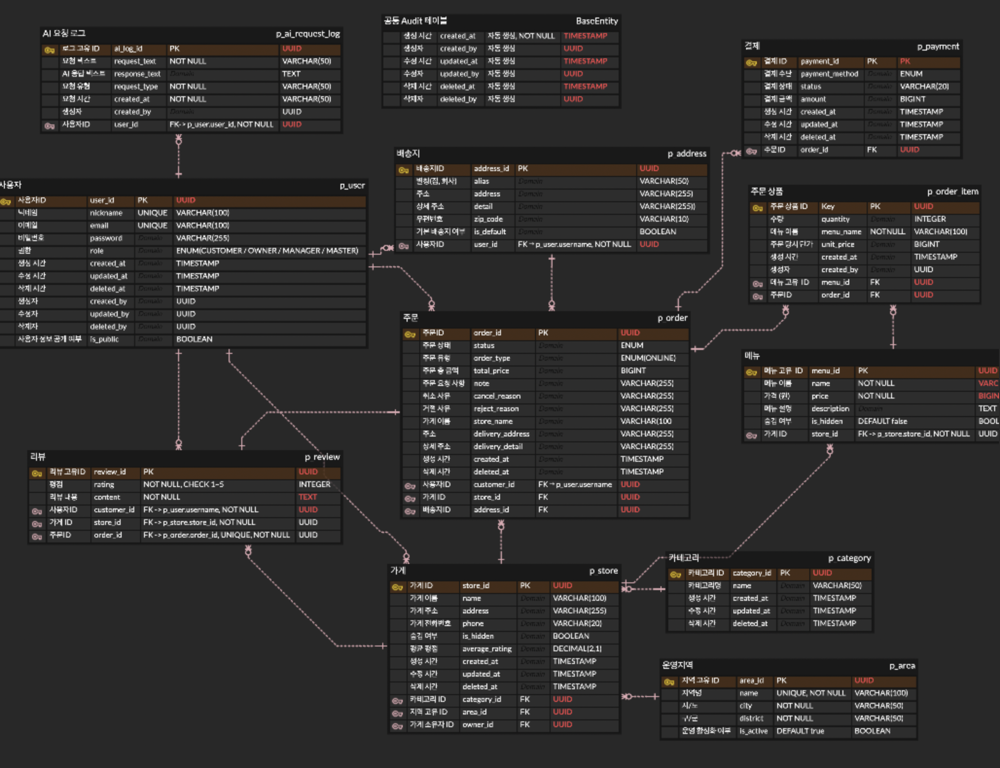

# 🍱 오늘한끼

<div align="center">

> **배달 주문, 결제, 관리를 한 번에 — AI가 당신의 오늘 한 끼를 추천해드립니다.**

</div>

---

## 📌 목차

1. [프로젝트 소개](#-프로젝트-소개)
2. [팀원 역할 분담](#-팀원-역할-분담)
3. [서비스 구성 및 실행 방법](#-서비스-구성-및-실행-방법)
4. [프로젝트 목적 / 상세](#-프로젝트-목적--상세)
5. [기술 스택](#-기술-스택)
6. [ERD](#-erd)
7. [API 명세서](#-api-명세서)
8. [문서화](#-문서화)

---

## 🍽️ 프로젝트 소개

**오늘한끼**는 배달 주문부터 결제, 주문 내역 관리까지 하나의 플랫폼에서 처리할 수 있는 **통합 배달 주문 관리 서비스**입니다.

상품 등록 시 **Gemini AI가 상품 설명을 자동으로 생성**해, 가게 사장님이 직접 문구를 작성하지 않아도 완성도 높은 상품 정보를 등록할 수 있습니다.
AI가 생성한 모든 요청과 응답은 별도로 기록되어 관리됩니다.

| 핵심 기능 | 설명 |
|---|---|
| 🛒 **주문 · 결제** | 주문 접수부터 카드 결제, 5분 이내 취소 제한까지 처리 |
| 🏪 **가게 · 카테고리 관리** | 운영 지역 기반 가게 등록 및 카테고리별 메뉴 관리 |
| 🤖 **AI 상품 설명 생성** | Gemini AI가 메뉴 등록 시 상품 설명을 자동으로 생성 |
| 🔐 **인증 · 권한 관리** | JWT 기반 로그인, 역할별(Customer/Owner/Manager/Master) 접근 제어 |
| ⭐ **리뷰 · 평점** | 완료된 주문에 한해 리뷰 작성, 가게별 평균 평점 제공 |

---

## 📅 개발 기간

```
2025.04.16 (수) ~ 2025.04.30 (수)
```

---

## 👥 팀원 역할 분담

<div align="center">

| 손형호 | 김윤아 | 맹현지 | 오영현 | 최리아 |
|:---:|:---:|:---:|:---:|:---:|
|  |  |  |  |  |
| [](https://github.com/GolemOnce) | [](https://github.com/1-yuna) | [](https://github.com/gray-ji) | [](https://github.com/dddd2356) | [](https://github.com/riiach) |
| 👑 팀장<br/>결제 · 리뷰<br/>배달지 · 배포 | 가게 · 운영지역<br/>카테고리 | 인증 · 사용자<br/>JWT | 주문<br/>주문 상태 관리 | 메뉴<br/>AI |

</div>

---

## 🚀 서비스 구성 및 실행 방법

### 사전 요구사항

- Docker & Docker Compose 설치
- Java 17 이상

### 실행 방법

```bash
# 1. 레포지토리 클론
git clone https://github.com/GolemOnce/Sparta-TodayEats.git
cd Sparta-TodayEats

# 2. Docker Compose로 전체 서비스 실행
docker-compose up -d

# 3. 서비스 상태 확인
docker-compose ps

# 4. 로그 확인
docker-compose logs -f

# 5. 서비스 종료
docker-compose down
```

### Docker Compose 구성

```
서비스 구성
├── app        (Spring Boot 애플리케이션)
├── db         (PostgreSQL)
└── redis      (Redis 캐시)
```

---

## 🎯 프로젝트 목적 / 상세

### 🛒 주문 · 결제
- 주문 시점 데이터 스냅샷 저장으로 데이터 무결성 보장
- 결제 시 동시성 제어 및 중복 결제 방지
- 주문 상태 기반 취소/환불 처리

### 🏪 가게 · 카테고리
- 사용자 역할에 따른 조회 범위 제어
- 카테고리 및 가게 검색 기능 (QueryDSL 동적 검색)
- 소프트 삭제 및 중복 방지 정책 적용

### 🔐 인증 · 사용자
- 이메일 인증 기반 회원가입
- JWT + Refresh Token 인증 구조
- 역할 기반 접근 제어

### 🤖 메뉴 · AI
- 메뉴 상태(노출/품절) 관리
- AI 기반 메뉴 설명 자동 생성

### 💳 결제 · 리뷰 · 배송지
- 리뷰 및 평점 시스템
- 배송지 관리

---

## 🛠️ 기술 스택

<div align="center">

| 분류 | 기술 |
|:---:|:---|
| **Backend** |    |
| **Database** |   |
| **AI** |  |
| **Infra** |    |

</div>

---

## 📐 ERD

<div align="center">



</div>

---

## 📄 API 명세서

> 추후 작성 예정

---

## 📚 문서화

| 구분 | 설명 |
|---|---|
| [프로젝트 개요](docs/project-overview.md) | 프로젝트 명, 서비스 요약 및 핵심 기능 정의 |
| [시스템 흐름](docs/flow.md) | 주문/결제/상태 변경 시퀀스 |
| [도메인 구조](docs/domain.md) | 권한 구조, 도메인 구성, 도메인 간 관계 정의 |
| [데이터 설계](docs/data.md) | 테이블 네이밍 규칙, ERD |
| [기술 및 아키텍처](docs/architecture.md) | 사용 기술 스택과 전체 시스템 구조, 패키지 아키텍처 설계 방식 정의 |
| [개발 규칙](docs/convention.md) | 네이밍 규칙, DTO 설계 기준, Git 이슈 PR 규칙 등 협업 규칙 |
| [인프라](docs/infra.md) | 배포 구조, 서버 환경, 인프라 구성 및 설정 정보 |

---

<div align="center">

**오늘한끼** · 2026 © All Rights Reserved

</div>