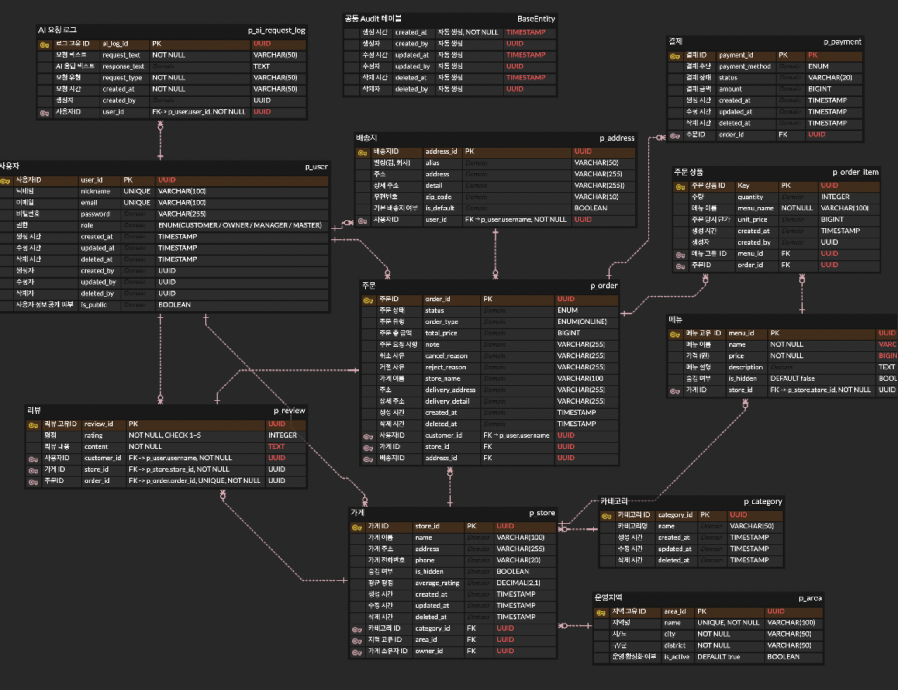

# 🍱 오늘한끼

<div align="center">

> **배달 주문, 결제, 관리를 한 번에 — AI가 당신의 오늘 한 끼를 추천해드립니다.**

</div>

---

## 📌 목차

1. [프로젝트 소개](#-프로젝트-소개)
2. [팀원 역할 분담](#-팀원-역할-분담)
3. [서비스 구성 및 실행 방법](#-서비스-구성-및-실행-방법)
4. [프로젝트 목적 / 상세](#-프로젝트-목적--상세)
5. [ERD](#-erd)
6. [기술 스택](#-기술-스택)
7. [API 명세서](#-api-명세서)
8. [문서화](#-문서화)

---

## 🍽️ 프로젝트 소개

**오늘한끼**는 배달 주문부터 결제, 주문 내역 관리까지 하나의 플랫폼에서 처리할 수 있는 **통합 배달 주문 관리 서비스**입니다.

상품 등록 시 **Gemini AI가 상품 설명을 자동으로 생성**해, 가게 사장님이 직접 문구를 작성하지 않아도 완성도 높은 상품 정보를 등록할 수 있습니다.
AI가 생성한 모든 요청과 응답은 별도로 기록되어 관리됩니다.

| 핵심 기능 | 설명 |
|---|---|
| 🛒 **주문 · 결제** | 주문 접수부터 카드 결제, 5분 이내 취소 제한까지 처리 |
| 🏪 **가게 · 카테고리 관리** | 운영 지역 기반 가게 등록 및 카테고리별 메뉴 관리 |
| 🤖 **AI 상품 설명 생성** | Gemini AI가 메뉴 등록 시 상품 설명을 자동으로 생성 |
| 🔐 **인증 · 권한 관리** | JWT 기반 로그인, 역할별(Customer/Owner/Manager/Master) 접근 제어 |
| ⭐ **리뷰 · 평점** | 완료된 주문에 한해 리뷰 작성, 가게별 평균 평점 제공 |

---

## 📅 개발 기간

```
2025.04.16 (수) ~ 2025.04.30 (수)
```

---

## 👥 팀원 역할 분담

<div align="center">

| 손형호 | 김윤아 | 맹현지 | 오영현 | 최리아 |
|:---:|:---:|:---:|:---:|:---:|
|  |  |  |  |  |
| [](https://github.com/GolemOnce) | [](https://github.com/1-yuna) | [](https://github.com/gray-ji) | [](https://github.com/dddd2356) | [](https://github.com/riiach) |
| 👑 팀장<br/>결제 · 리뷰<br/>배달지 · 배포 | 가게 · 운영지역<br/>카테고리 | 인증 · 사용자<br/>JWT | 주문<br/>주문 상태 관리 | 메뉴<br/>AI |

</div>

---

## 🚀 서비스 구성 및 실행 방법

### 사전 요구사항

- Docker & Docker Compose 설치
- Java 17 이상

### 실행 방법

```bash
# 1. 레포지토리 클론
git clone https://github.com/GolemOnce/Sparta-TodayEats.git
cd Sparta-TodayEats

# 2. Docker Compose로 전체 서비스 실행
docker-compose up -d

# 3. 서비스 상태 확인
docker-compose ps

# 4. 로그 확인
docker-compose logs -f

# 5. 서비스 종료
docker-compose down
```

### Docker Compose 구성

```
서비스 구성
├── app        (Spring Boot 애플리케이션)
├── db         (PostgreSQL)
└── redis      (Redis 캐시)
```

---

## 🎯 프로젝트 목적 / 상세

### 목적
배달 주문 서비스를 직접 설계·구현하며, 단순 기능 구현에 그치지 않고 **추후 기능 확장을 고려한 구조 설계**를 목표로 하였습니다.
역할 기반 접근 제어, 동시성 제어, 데이터 무결성 등 실무에서 요구되는 백엔드 핵심 역량을 경험하고, 확장 가능한 서비스 구조를 고민하며 개발하였습니다.

### 상세
#### 🛒 주문 · 결제
- 주문 시점 데이터 스냅샷 저장으로 데이터 무결성 보장
- 결제 시 동시성 제어 및 중복 결제 방지
- 주문 상태 기반 취소/환불 처리

#### 🏪 가게 · 카테고리
- 사용자 역할에 따른 조회 범위 세분화
- 카테고리 및 가게 검색 기능 (QueryDSL 동적 검색)
- 도메인 간 정합성 보호

#### 🔐 인증 · 사용자
- 이메일 인증 기반 회원가입
- JWT + Refresh Token 인증 구조
- 역할 기반 접근 제어

#### 🤖 메뉴 · AI
- 역할별 메뉴 노출 정책
- 품절·숨김 여부 별도 관리
- AI 기반 메뉴 설명 자동 생성

#### 💳 결제 · 리뷰 · 배송지
- 완료된 주문에 한해 리뷰 작성 및 가게별 평균 평점 제공
- 배송지 관리

---

## 🛠️ 기술 스택

<div align="center">

| 분류 | 기술 |
|:---:|:---|
| **Backend** |    |
| **Database** |   |
| **AI** |  |
| **Infra** |    |

</div>

---

## 📐 ERD

<div align="center">



</div>


---

## 📄 API 명세서

## 📌 API 명세

### 권한(Role) 구분

| Role | 설명 |
|------|------|
| `CUSTOMER` | 일반 고객 |
| `OWNER` | 가게 사장님 |
| `MANAGER` | 서비스 관리자 |
| `MASTER` | 최고 관리자 |
| `ALL` | 인증 여부/권한 무관 접근 가능 |
| `본인` | 요청자가 해당 리소스의 소유자인 경우 |

---

### 🔐 Auth

| Method | Endpoint | 설명 | 권한 | 비고 |
|--------|----------|------|------|------|
| `POST` | `/api/v1/auth/verify-code/send` | 회원가입 인증번호 발송 | ALL | |
| `POST` | `/api/v1/auth/verify-code/confirm` | 회원가입 인증번호 확인 | ALL | |
| `POST` | `/api/v1/auth/signup` | 회원가입 | ALL | 인증 완료된 이메일만 가능 |
| `POST` | `/api/v1/auth/login` | 로그인 | ALL | |
| `POST` | `/api/v1/auth/reissue` | 토큰 재발급 | ALL | |
| `POST` | `/api/v1/auth/logout` | 로그아웃 | ALL | |
| `POST` | `/api/v1/auth/reset-password/send` | 비밀번호 재설정 링크 발송 | ALL | |
| `GET` | `/api/v1/auth/reset-password` | 비밀번호 재설정 링크 확인 | ALL | |
| `PATCH` | `/api/v1/auth/reset-password` | 비밀번호 재설정 | ALL | |

#### Redis Key 설계

| 용도 | Key | Value | 사용 API |
|------|-----|-------|----------|
| 회원가입 인증번호 | `AUTH_SIGNUP:{email}` | `{code}` | 인증번호 발송 |
| 이메일 인증 완료 여부 | `AUTH_VERIFIED:{email}` | `true` | 인증번호 확인 |
| Refresh Token | `AUTH_RT:{email}` | `{refreshToken}` | 로그인, 토큰 재발급, 로그아웃 |
| 비밀번호 재설정 코드 | `AUTH_RESET_PASSWORD:{code}` | `{email}` | 재설정 링크 발송 |

---

### 👤 User

| Method | Endpoint | 설명 | 권한 | 비고 |
|--------|----------|------|------|------|
| `GET` | `/api/v1/users` | 사용자 목록 조회 | MANAGER, MASTER | |
| `GET` | `/api/v1/users/{userId}` | 사용자 상세 조회 | MANAGER, MASTER, 본인 | |
| `PUT` | `/api/v1/users` | 사용자 정보 수정 | ALL | 로그인한 사용자 본인 정보 |
| `PATCH` | `/api/v1/users/password` | 비밀번호 변경 | ALL | |
| `PATCH` | `/api/v1/users/{userId}/role` | 사용자 권한 변경 | MASTER | |
| `DELETE` | `/api/v1/users/{userId}` | 사용자 삭제 | MASTER, 본인 | 진행 중인 주문이 없을 때만 가능 |

---

### 🗺️ Area

| Method | Endpoint | 설명 | 권한 | 비고 |
|--------|----------|------|------|------|
| `POST` | `/api/v1/areas` | 지역 등록 | MANAGER, MASTER | |
| `GET` | `/api/v1/areas` | 지역 목록 조회 | ALL | |
| `GET` | `/api/v1/areas/{areaId}` | 지역 상세 조회 | ALL | |
| `PUT` | `/api/v1/areas/{areaId}` | 지역 수정 | MANAGER, MASTER | |
| `DELETE` | `/api/v1/areas/{areaId}` | 지역 삭제 | MASTER | |

---

### 🏠 Address

| Method | Endpoint | 설명 | 권한 | 비고 |
|--------|----------|------|------|------|
| `POST` | `/api/v1/addresses` | 배송지 등록 | CUSTOMER | |
| `GET` | `/api/v1/addresses` | 배송지 목록 조회 | CUSTOMER | |
| `GET` | `/api/v1/addresses/{addressId}` | 배송지 상세 조회 | CUSTOMER | |
| `PUT` | `/api/v1/addresses/{addressId}` | 배송지 수정 | CUSTOMER | |
| `PATCH` | `/api/v1/addresses/{addressId}/default` | 기본 배송지 설정 | CUSTOMER | |
| `DELETE` | `/api/v1/addresses/{addressId}` | 배송지 삭제 | CUSTOMER, MASTER | |

---

### 🏷️ Category

| Method | Endpoint | 설명 | 권한 | 비고 |
|--------|----------|------|------|------|
| `POST` | `/api/v1/categories` | 카테고리 등록 | MANAGER, MASTER | |
| `GET` | `/api/v1/categories` | 카테고리 목록 조회 | ALL | |
| `GET` | `/api/v1/categories/{categoryId}` | 카테고리 상세 조회 | ALL | |
| `PUT` | `/api/v1/categories/{categoryId}` | 카테고리 수정 | MANAGER, MASTER | |
| `DELETE` | `/api/v1/categories/{categoryId}` | 카테고리 삭제 | MASTER | |

---

### 🏪 Store

| Method | Endpoint | 설명 | 권한 | 비고 |
|--------|----------|------|------|------|
| `POST` | `/api/v1/stores` | 가게 등록 | OWNER | 본인 가게만 가능 |
| `GET` | `/api/v1/stores` | 가게 목록 조회 | ALL | |
| `GET` | `/api/v1/stores/{storeId}` | 가게 상세 조회 | ALL | |
| `PATCH` | `/api/v1/stores/{storeId}` | 가게 수정 | MANAGER, MASTER, OWNER | OWNER는 본인 가게만 가능 |
| `PATCH` | `/api/v1/stores/{storeId}/hide` | 가게 숨김 처리 | MANAGER, MASTER, OWNER | |
| `DELETE` | `/api/v1/stores/{storeId}` | 가게 삭제 | MASTER, OWNER | OWNER는 본인 가게만 가능 |

---

### 🍽️ Menu

| Method | Endpoint | 설명 | 권한 | 비고 |
|--------|----------|------|------|------|
| `POST` | `/api/v1/stores/{storeId}/menus` | 메뉴 등록 | MANAGER, MASTER, OWNER | OWNER는 본인 가게만 가능 |
| `GET` | `/api/v1/stores/{storeId}/menus` | 메뉴 목록 조회 | ALL | |
| `GET` | `/api/v1/stores/{storeId}/menus/manage` | 사장님 메뉴 조회 | MANAGER, MASTER, OWNER | OWNER는 본인 가게만 가능 |
| `GET` | `/api/v1/stores/{storeId}/menus/{menuId}` | 메뉴 상세 조회 | ALL | |
| `PATCH` | `/api/v1/menus/{menuId}` | 메뉴 수정 | MANAGER, MASTER, OWNER | OWNER는 본인 메뉴만 가능 |
| `DELETE` | `/api/v1/menus/{menuId}` | 메뉴 삭제 | MASTER, OWNER | OWNER는 본인 메뉴만 가능 |
| `POST` | `/api/v1/ai/product-description` | AI 메뉴 설명 생성 | MANAGER, MASTER, OWNER | |

---

### 🧾 Order

| Method | Endpoint | 설명 | 권한 | 비고 |
|--------|----------|------|------|------|
| `POST` | `/api/v1/orders` | 주문 생성 | CUSTOMER | |
| `GET` | `/api/v1/orders` | 주문 내역 조회 | CUSTOMER, MANAGER, MASTER | |
| `GET` | `/api/v1/orders/{orderId}` | 주문 상세 조회 | CUSTOMER, MANAGER, MASTER | |
| `PUT` | `/api/v1/orders/{orderId}` | 주문 수정 (요청사항) | CUSTOMER | `PENDING` 상태에서만 가능 |
| `PATCH` | `/api/v1/orders/{orderId}/status` | 주문 상태 변경 | MANAGER, MASTER, OWNER | |
| `PATCH` | `/api/v1/orders/{orderId}/cancel` | 주문 취소 | CUSTOMER, MASTER | CUSTOMER는 주문 후 5분 이내 + `PENDING` 상태에서만 가능 |
| `PATCH` | `/api/v1/orders/{orderId}/reject` | 주문 거절 | MANAGER, MASTER, OWNER | `PENDING` 상태에서만 가능 |
| `DELETE` | `/api/v1/orders/{orderId}` | 주문 삭제 | MASTER | Soft Delete |

---

### 💳 Payment

| Method | Endpoint | 설명 | 권한 | 비고 |
|--------|----------|------|------|------|
| `POST` | `/api/v1/orders/{orderId}/payments` | 결제 처리 | 본인 | |
| `GET` | `/api/v1/payments` | 결제 목록 조회 | MANAGER, MASTER, 본인 | |
| `GET` | `/api/v1/payments/{paymentId}` | 결제 상세 조회 | MANAGER, MASTER, 본인 | |
| `PUT` | `/api/v1/payments/{paymentId}` | 결제 상태 변경 | MANAGER, MASTER | |
| `DELETE` | `/api/v1/payments/{paymentId}` | 결제 삭제 | MASTER | |

---

### ⭐ Review

| Method | Endpoint | 설명 | 권한 | 비고 |
|--------|----------|------|------|------|
| `POST` | `/api/v1/orders/{orderId}/reviews` | 리뷰 등록 | CUSTOMER | 본인 주문에 대해서만 작성 가능 |
| `GET` | `/api/v1/reviews` | 리뷰 목록 조회 | ALL | MANAGER, MASTER: 가게/사용자별 조회<br>CUSTOMER, OWNER: 가게 리뷰 / 내 리뷰 조회 |
| `GET` | `/api/v1/reviews/{reviewId}` | 리뷰 상세 조회 | ALL | |
| `PUT` | `/api/v1/reviews/{reviewId}` | 리뷰 수정 | CUSTOMER | |
| `DELETE` | `/api/v1/reviews/{reviewId}` | 리뷰 삭제 | CUSTOMER, MANAGER, MASTER | CUSTOMER는 본인 리뷰만 가능 |

---

## 📚 문서화

| 구분                                    | 설명                                      |
|---------------------------------------|-----------------------------------------|
| [프로젝트 개요](docs/project-overview.md)   | 프로젝트 명, 서비스 요약 및 핵심 기능 정의               |
| [시스템 흐름](docs/flow.md)                | 주문/결제/상태 변경 시퀀스                         |
| [도메인 구조](docs/domain.md)              | 권한 구조, 도메인 구성, 도메인 간 관계 정의              |
| [데이터 설계](docs/data.md)                | 테이블 네이밍 규칙, ERD                         |
| [기술 및 아키텍처](docs/architecture.md)     | 사용 기술 스택과 전체 시스템 구조, 패키지 아키텍처 설계 방식 정의  |
| [개발 규칙](docs/convention.md)           | 네이밍 규칙, DTO 설계 기준, Git 이슈 PR 규칙 등 협업 규칙 |
| [인프라](docs/infra.md)                  | 배포 구조, 서버 환경, 인프라 구성 및 설정 정보       |
| [시퀀스 다이어그램](docs/sequence_diagram.md) | 각 도메인별 API의 요청, 응답, 에러 처리 흐름      |


---

<div align="center">

**오늘한끼** · 2026 © All Rights Reserved

</div>