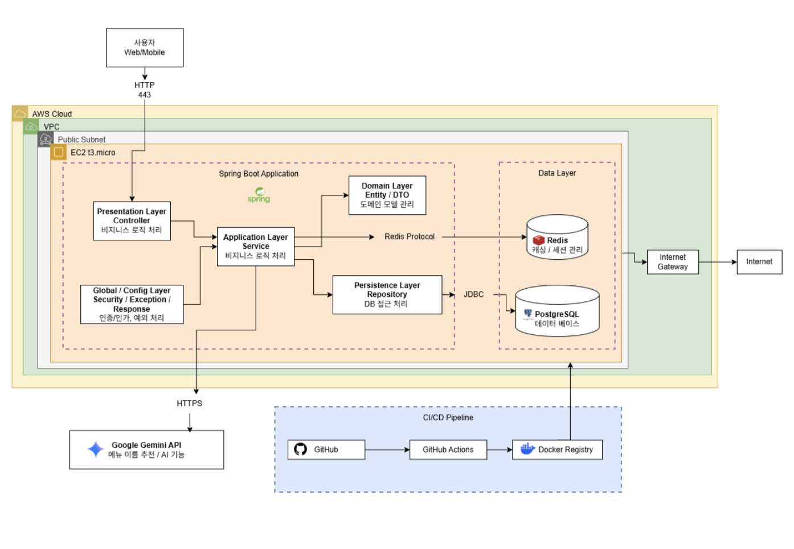

## 기술 스택

| 구분 | 기술 | 버전                      | 설명 |
|------|------|-------------------------|------|
| Language | Java | 17 (LTS)                | 백엔드 개발 언어 |
| Framework | Spring Boot | 3.5.13                  | 주요 백엔드 프레임워크 |
| Security | Spring Security + JWT | jjwt                    | 인증 및 권한 관리, 매 요청 DB 권한 재검증 |
| Validation | Spring Validation | -                       | DTO 유효성 검증 |
| ORM | JPA / Hibernate | -                       | 객체-관계 매핑 |
| Query | QueryDSL JPA | -                       | [도전] 복합 검색 구현 |
| Database | PostgreSQL | 15.17                   | AWS EC2 직접 설치 및 운영 |
| Build Tool | Gradle | 9.4.1                   | 빌드 및 의존성 관리 |
| API Docs | springdoc-openapi (Swagger) | -                       | API 문서 자동화 |
| AI | Google Gemini 1.5 Flash | -                       | 메뉴 설명 생성 및 분석 |
| HTTP Client | WebClient / RestTemplate | -                       | AI API 호출용 |
| Logging | Logback | -                       | [도전] 로그 관리 |
| Server | AWS EC2 | t3.micro / Ubuntu 22.04 | 배포 환경 |


---

## 아키텍처

<div align="center">



</div>

### 1. 구조 방식
- 모놀리식 아키텍처


### 2. 설계 이유
- 초기 프로젝트 구조 단순화 및 빠른 개발 진행을 위해 모놀리식 구조로 설계
- 도메인 단위 패키지 분리를 통해 유지보수성과 확장성을 고려
- 향후 마이크로서비스 구조로 확장 가능하도록 계층 분리 설계 적용


---
## 패키지 구조

- 도메인형 패키지 구조와 3 Layer Architecture로 구성

```text
src/main/java/com/sparta/todayeats
│
├── global
│   └── infrastructure
│       ├── config
│       │   ├── security
│       │   │   ├── SecurityConfig.java
│       │   │   ├── JwtTokenProvider.java
│       │   │   └── JwtAuthenticationFilter.java
│       │   └── QueryDslConfig.java
│       ├── presentation
│       │   └── advice
│       │       └── GlobalExceptionHandler.java
│       └── entity
│           └── BaseEntity.java
│
├── user
│   ├── controller/UserController.java
│   ├── dto
│   │   ├── request/*Request.java
│   │   └── response/*Response.java
│   ├── entity
│   │   ├── UserEntity.java
│   │   └── UserRoleEnum.java
│   ├── repository/UserRepository.java
│   └── service/UserService.java
│
├── auth
│   ├── application/service
│   │   ├── AuthMailService.java
│   │   └── AuthService.java
│   └── presentation
│       ├── controller/AuthController.java
│       └── dto
│           ├── request/*Request.java
│           └── response/*Response.java
│
├── address
│   ├── controller/UserController.java
│   ├── dto
│   │   ├── request/*Request.java
│   │   └── response/*Response.java
│   ├── entity/Address.java
│   ├── repository/AddressRepository.java
│   └── service/AddressService.java
│
...
