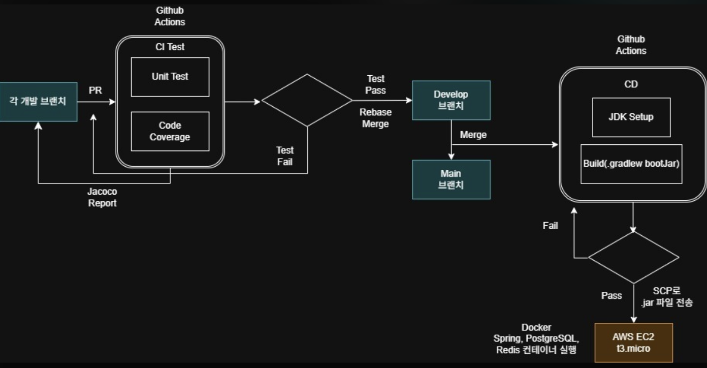

## 인프라 & 배포

---

### 1. 시스템 아키텍처
```
   [ GitHub Repository ]
   |
   | push to main
   ▼
   [ GitHub Actions ]
   ├─ 테스트 (./gradlew test)
   ├─ 빌드 (./gradlew bootJar)
   └─ EC2 배포 (SSH)
   |
   ▼
   [ AWS EC2 (Ubuntu) ]
   ├─ Spring Boot  :8080
   ├─ PostgreSQL   :5432
   └─ Redis        :6379
```

---

### 2. 환경 구성
#### 로컬 개발 환경
>PostgreSQL, Redis는 Docker로 로컬에 띄우고 Spring은 IntelliJ에서 직접 실행.
- 실행 방법
```bash
# 1. DB/Redis 컨테이너 실행
docker-compose -f docker-compose.local.yml --env-file .env.local up -d

# 2. IntelliJ에서 Spring 실행
# Run Configuration → Active profiles: local
```

- 필요 파일 (git 미포함 → 직접 생성 필요)
  - application-local.yml : 로컬 DB/Redis 연결 정보
  - .env.local : Docker Compose 환경변수
<br></br>
#### 운영 환경 (EC2)
>모든 서비스(Spring, PostgreSQL, Redis)를 Docker Compose로 EC2에서 실행.
- 실행 방법
```bash
docker-compose up -d --build
```
- 필요 파일 (git 미포함 → EC2에 직접 생성 필요)
  - .env : 운영 Docker Compose 환경변수

### 4. 환경변수 목록
```
.env.example
# Postgres
POSTGRES_DB=
POSTGRES_USER=
POSTGRES_PASSWORD=

// .env 전용
# Spring Datasource
SPRING_DATASOURCE_URL=
SPRING_DATASOURCE_USERNAME=
SPRING_DATASOURCE_PASSWORD=

# Redis
REDIS_PASSWORD=

# Gemini
GEMINI_API_KEY=
GEMINI_API_URL=
```

---

### 5. CI/CD 파이프라인

<div align="center">



</div>

#### 트리거 
  - develop 브랜치에 Pull Request시 CI 테스트 진행
  - main 브랜치에 push(merge) 시 배포(CD) 자동 실행
<br></br>
#### 파이프라인 흐름
```
# CI
1. 코드 체크아웃
2. JDK 17 세팅
3. 테스트 실행 (실패 시 중단)
# CD
4. bootJar 빌드
5. SCP로 jar 파일 EC2 전송
6. EC2 SSH 접속
7. docker-compose down → up --build
```

#### 테스트
  - `JaCoCo` 코드 커버리지 리포트 활용(build/reports/jacoco/)
  - 우선 유닛 테스트만 작성해 Mock데이터로 비즈니스 로직 검증, 추후 통합테스트 도입을 대비해 CI 환경에 미리 PostgreSQL 컨테이너 도입함
  - 정상 케이스 + 예외 케이스 검증 가능한 테스트 작성
1. 테스트 작성 범위
- 필수) Service 레이어 유닛 테스트 
- 선택) Repository, Controller 레이어 유닛 테스트

2. 테스트 메서드명
```java
//한글로 가독성 있게 테스트 메서드명 작성
@Test
void 주문_수량이_0이면_예외발생() { }

@Test
void 정상_주문_생성_성공() { }
```
3. 테스트 구조 (given/when/then)
```java
@Test
void 식당_생성_성공() {
  // given
  CreateRestaurantRequest request = new CreateRestaurantRequest("맛집");

  // when
  Restaurant result = restaurantService.create(request);

  // then
  assertThat(result.getName()).isEqualTo("맛집");
}
``` 
4. 통합테스트 도입 시기
- 유닛 테스트 Mock데이터로 검증하지 못하는 문제 발생 시 통합테스트 도입 고려.
- 여러 레이어를 거치는 핵심 비즈니스로직이 한 트랜잭션 내에서 일어날 때.
- 타인의 코드에 영향을 주기 시작하는 시기

#### GitHub Secrets 설정
  - `EC2_HOST` : EC2 퍼블릭 IP
  - `EC2_USERNAME` : EC2 접속 유저명 (ubuntu)
  - `EC2_SSH_KEY` : .pem 파일 전체 내용
  - `SPRING_DATASOURCE_URL` : 운영 DB URL
  - `SPRING_DATASOURCE_USERNAME` : 운영 DB 유저명
  - `SPRING_DATASOURCE_PASSWORD` : 운영 DB 비밀번호
  - `REDIS_PASSWORD` : Redis 비밀번호
---
### 6. 로컬 개발 환경 세팅 가이드
- 처음 세팅하는 팀원을 위한 가이드.
1. 레포 클론
```bash
git clone https://github.com/GolemOnce/Sparta-TodayEats.git
cd Sparta-TodayEats
```
2. 환경 파일 생성
- 루트 디렉토리에 .env.local 생성 후 값 채우기.
- src/main/resources/application-local.yml 생성 후 값 채우기.
3. 로컬 DB/Redis 실행
```
docker-compose -f docker-compose.local.yml --env-file .env.local up -d
```
4. Spring 실행
- IntelliJ → 상단 Run탭 → Run Configuration → Active profiles: local 설정 → 실행(Run)