# Sequence Diagram
- 본 문서는 오늘한끼 서비스 도메인별 API의 흐름을 Sequence Diagram형태로 자세히 나타냅니다. 

## 1. Auth
### 1. 인증코드 전송:
``` mermaid                                                                                                                       
  sequenceDiagram
      actor Client
      participant AuthController
      participant AuthService
      participant UserRepository
      participant AuthMailService
      participant Redis

      Note over Client,Redis: POST /api/v1/auth/verify-code/send
      Client->>AuthController: POST /api/v1/auth/verify-code/send {email}
      AuthController->>AuthService: sendSignupCode(email)
      AuthService->>UserRepository: findByEmail(email)
      alt 이미 가입되고 삭제되지 않은 이메일
          AuthService-->>Client: 409 DUPLICATE_EMAIL
      end
      AuthService->>AuthMailService: sendSignupCode(email, code)
      AuthMailService-->>Client: 인증코드 이메일 발송
      AuthService->>Redis: SET AUTH_SIGNUP:{email} = code (5분)
      AuthService-->>AuthController: CodeResponse{email, expiresAt}
      AuthController-->>Client: 200 OK
```
### 2. 인증코드 확인:
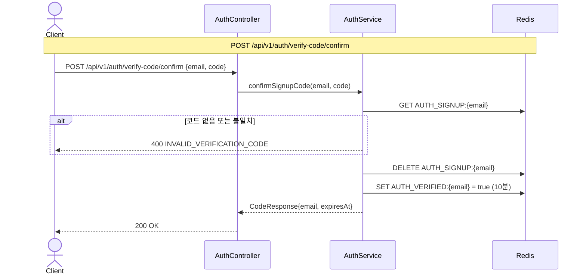
```mermaid
  sequenceDiagram
      actor Client
      participant AuthController
      participant AuthService
      participant Redis

      Note over Client,Redis: POST /api/v1/auth/verify-code/confirm
      Client->>AuthController: POST /api/v1/auth/verify-code/confirm {email, code}
      AuthController->>AuthService: confirmSignupCode(email, code)
      AuthService->>Redis: GET AUTH_SIGNUP:{email}
      alt 코드 없음 또는 불일치
          AuthService-->>Client: 400 INVALID_VERIFICATION_CODE
      end
      AuthService->>Redis: DELETE AUTH_SIGNUP:{email}
      AuthService->>Redis: SET AUTH_VERIFIED:{email} = true (10분)
      AuthService-->>AuthController: CodeResponse{email, expiresAt}
      AuthController-->>Client: 200 OK
```

### 3. 회원가입
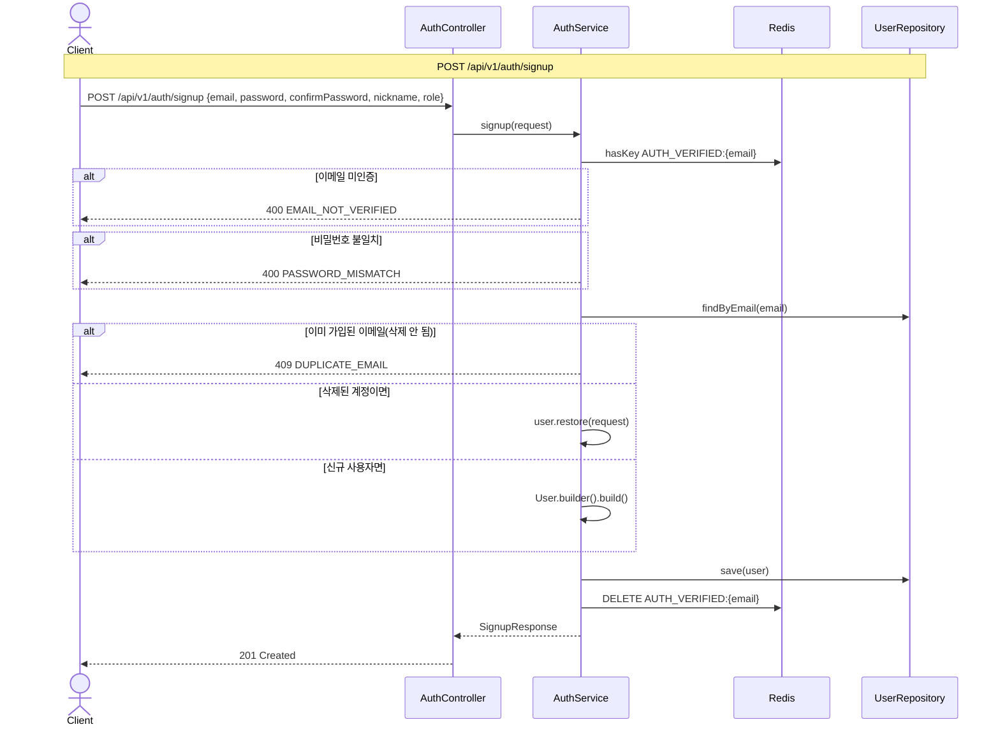
```mermaid
  sequenceDiagram
      actor Client
      participant AuthController
      participant AuthService
      participant Redis
      participant UserRepository

      Note over Client,UserRepository: POST /api/v1/auth/signup
      Client->>AuthController: POST /api/v1/auth/signup {email, password, confirmPassword, nickname, role}
      AuthController->>AuthService: signup(request)
      AuthService->>Redis: hasKey AUTH_VERIFIED:{email}
      alt 이메일 미인증
          AuthService-->>Client: 400 EMAIL_NOT_VERIFIED
      end
      alt 비밀번호 불일치
          AuthService-->>Client: 400 PASSWORD_MISMATCH
      end
      AuthService->>UserRepository: findByEmail(email)
      alt 이미 가입된 이메일(삭제 안 됨)
          AuthService-->>Client: 409 DUPLICATE_EMAIL
      else 삭제된 계정이면
          AuthService->>AuthService: user.restore(request)
      else 신규 사용자면
          AuthService->>AuthService: User.builder().build()
      end
      AuthService->>UserRepository: save(user)
      AuthService->>Redis: DELETE AUTH_VERIFIED:{email}
      AuthService-->>AuthController: SignupResponse
      AuthController-->>Client: 201 Created
```
### 4. 로그인
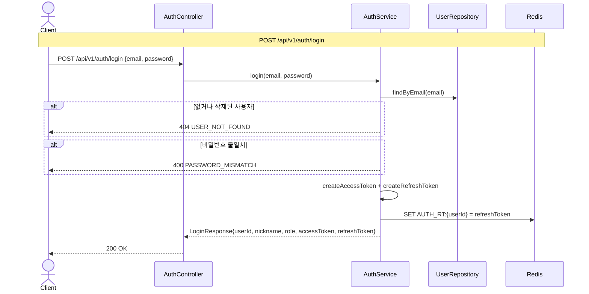
```mermaid
  sequenceDiagram
      actor Client
      participant AuthController
      participant AuthService
      participant UserRepository
      participant Redis

      Note over Client,Redis: POST /api/v1/auth/login
      Client->>AuthController: POST /api/v1/auth/login {email, password}
      AuthController->>AuthService: login(email, password)
      AuthService->>UserRepository: findByEmail(email)
      alt 없거나 삭제된 사용자
          AuthService-->>Client: 404 USER_NOT_FOUND
      end
      alt 비밀번호 불일치
          AuthService-->>Client: 400 PASSWORD_MISMATCH
      end
      AuthService->>AuthService: createAccessToken + createRefreshToken
      AuthService->>Redis: SET AUTH_RT:{userId} = refreshToken
      AuthService-->>AuthController: LoginResponse{userId, nickname, role, accessToken, refreshToken}
      AuthController-->>Client: 200 OK
```
### 5. 토큰 재발급:
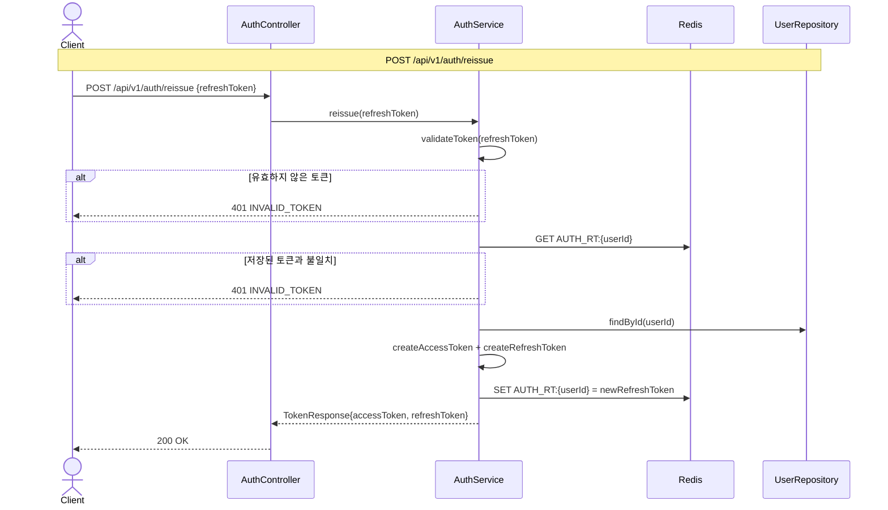
```mermaid
  sequenceDiagram
      actor Client
      participant AuthController
      participant AuthService
      participant Redis
      participant UserRepository

      Note over Client,UserRepository: POST /api/v1/auth/reissue
      Client->>AuthController: POST /api/v1/auth/reissue {refreshToken}
      AuthController->>AuthService: reissue(refreshToken)
      AuthService->>AuthService: validateToken(refreshToken)
      alt 유효하지 않은 토큰
          AuthService-->>Client: 401 INVALID_TOKEN
      end
      AuthService->>Redis: GET AUTH_RT:{userId}
      alt 저장된 토큰과 불일치
          AuthService-->>Client: 401 INVALID_TOKEN
      end
      AuthService->>UserRepository: findById(userId)
      AuthService->>AuthService: createAccessToken + createRefreshToken
      AuthService->>Redis: SET AUTH_RT:{userId} = newRefreshToken
      AuthService-->>AuthController: TokenResponse{accessToken, refreshToken}
      AuthController-->>Client: 200 OK
```
### 6. 로그아웃
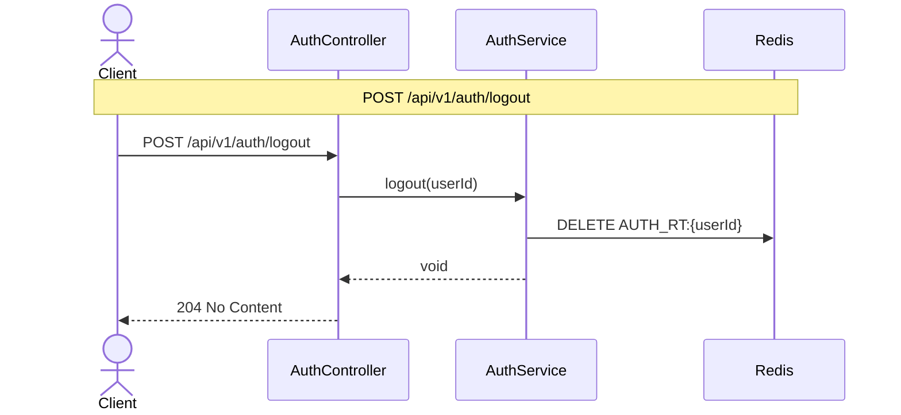
```mermaid
  sequenceDiagram
      actor Client
      participant AuthController
      participant AuthService
      participant Redis

      Note over Client,Redis: POST /api/v1/auth/logout
      Client->>AuthController: POST /api/v1/auth/logout
      AuthController->>AuthService: logout(userId)
      AuthService->>Redis: DELETE AUTH_RT:{userId}
      AuthService-->>AuthController: void
      AuthController-->>Client: 204 No Content
```
### 7. 비밀번호 재설정 링크 전송:
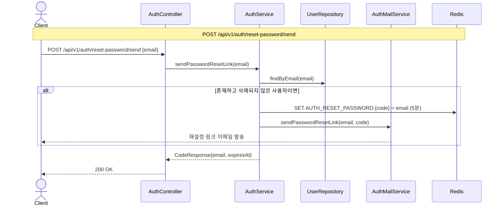
```mermaid
 sequenceDiagram                                                                                                                                                       
      actor Client
      participant AuthController
      participant AuthService
      participant UserRepository
      participant AuthMailService
      participant Redis

      Note over Client,Redis: POST /api/v1/auth/reset-password/send
      Client->>AuthController: POST /api/v1/auth/reset-password/send {email}
      AuthController->>AuthService: sendPasswordResetLink(email)
      AuthService->>UserRepository: findByEmail(email)
      alt 존재하고 삭제되지 않은 사용자이면
          AuthService->>Redis: SET AUTH_RESET_PASSWORD:{code} = email (5분)
          AuthService->>AuthMailService: sendPasswordResetLink(email, code)
          AuthMailService-->>Client: 재설정 링크 이메일 발송
      end
      AuthService-->>AuthController: CodeResponse{email, expiresAt}
      AuthController-->>Client: 200 OK

```
### 8. 비밀번호 재설정 링크 확인
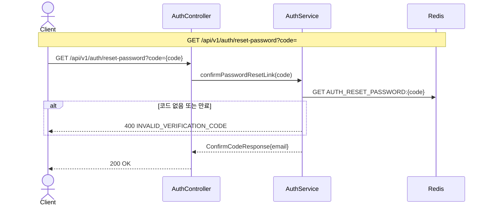
```mermaid
  sequenceDiagram
      actor Client
      participant AuthController
      participant AuthService
      participant Redis

      Note over Client,Redis: GET /api/v1/auth/reset-password?code=
      Client->>AuthController: GET /api/v1/auth/reset-password?code={code}
      AuthController->>AuthService: confirmPasswordResetLink(code)
      AuthService->>Redis: GET AUTH_RESET_PASSWORD:{code}
      alt 코드 없음 또는 만료
          AuthService-->>Client: 400 INVALID_VERIFICATION_CODE
      end
      AuthService-->>AuthController: ConfirmCodeResponse{email}
      AuthController-->>Client: 200 OK

```
### 9. 비밀번호 재설정
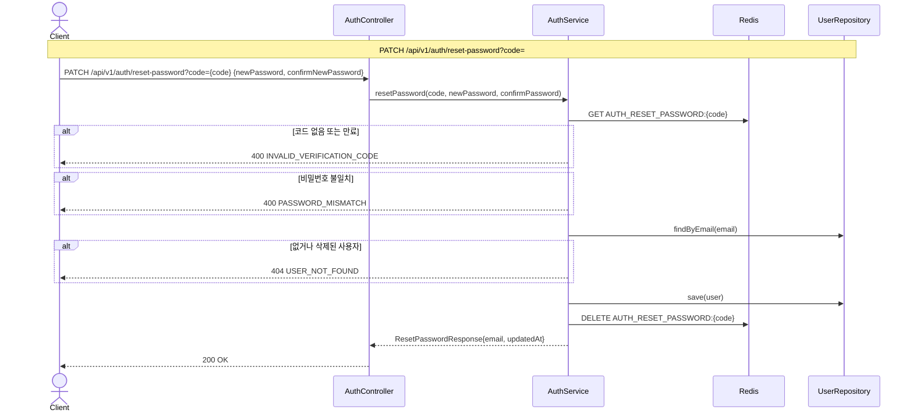
```mermaid
  sequenceDiagram
      actor Client
      participant AuthController
      participant AuthService
      participant Redis
      participant UserRepository

      Note over Client,UserRepository: PATCH /api/v1/auth/reset-password?code=
      Client->>AuthController: PATCH /api/v1/auth/reset-password?code={code} {newPassword, confirmNewPassword}
      AuthController->>AuthService: resetPassword(code, newPassword, confirmPassword)
      AuthService->>Redis: GET AUTH_RESET_PASSWORD:{code}
      alt 코드 없음 또는 만료
          AuthService-->>Client: 400 INVALID_VERIFICATION_CODE
      end
      alt 비밀번호 불일치
          AuthService-->>Client: 400 PASSWORD_MISMATCH
      end
      AuthService->>UserRepository: findByEmail(email)
      alt 없거나 삭제된 사용자
          AuthService-->>Client: 404 USER_NOT_FOUND
      end
      AuthService->>UserRepository: save(user)
      AuthService->>Redis: DELETE AUTH_RESET_PASSWORD:{code}
      AuthService-->>AuthController: ResetPasswordResponse{email, updatedAt}
      AuthController-->>Client: 200 OK
```
## 2. User
### 1. 사용자 목록 조회
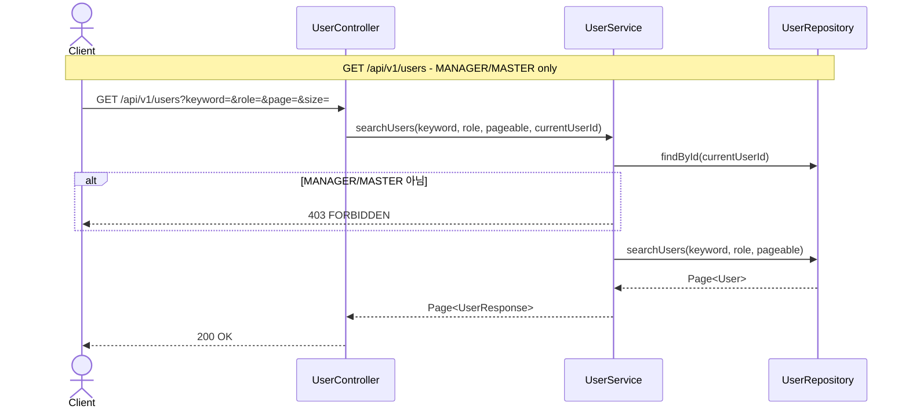
```mermaid
  sequenceDiagram
      actor Client
      participant UserController
      participant UserService
      participant UserRepository

      Note over Client,UserRepository: GET /api/v1/users - MANAGER/MASTER only
      Client->>UserController: GET /api/v1/users?keyword=&role=&page=&size=
      UserController->>UserService: searchUsers(keyword, role, pageable, currentUserId)
      UserService->>UserRepository: findById(currentUserId)
      alt MANAGER/MASTER 아님
          UserService-->>Client: 403 FORBIDDEN
      end
      UserService->>UserRepository: searchUsers(keyword, role, pageable)
      UserRepository-->>UserService: Page<User>
      UserService-->>UserController: Page<UserResponse>
      UserController-->>Client: 200 OK

```
### 2. 사용자 단건 조회
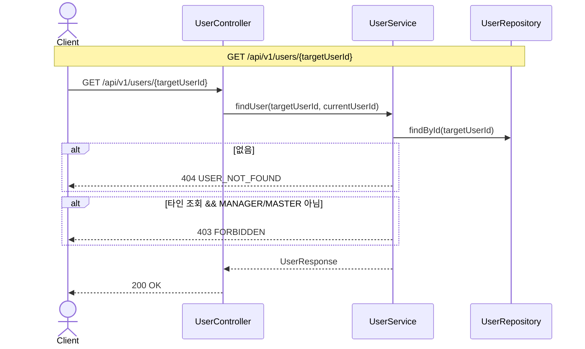
```mermaid
  sequenceDiagram
      actor Client
      participant UserController
      participant UserService
      participant UserRepository

      Note over Client,UserRepository: GET /api/v1/users/{targetUserId}
      Client->>UserController: GET /api/v1/users/{targetUserId}
      UserController->>UserService: findUser(targetUserId, currentUserId)
      UserService->>UserRepository: findById(targetUserId)
      alt 없음
          UserService-->>Client: 404 USER_NOT_FOUND
      end
      alt 타인 조회 && MANAGER/MASTER 아님
          UserService-->>Client: 403 FORBIDDEN
      end
      UserService-->>UserController: UserResponse
      UserController-->>Client: 200 OK

```
### 3. 사용자 정보 수정
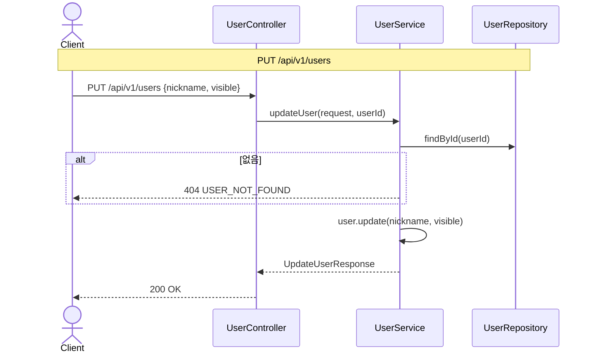
```mermaid
  sequenceDiagram
      actor Client
      participant UserController
      participant UserService
      participant UserRepository

      Note over Client,UserRepository: PUT /api/v1/users
      Client->>UserController: PUT /api/v1/users {nickname, visible}
      UserController->>UserService: updateUser(request, userId)
      UserService->>UserRepository: findById(userId)
      alt 없음
          UserService-->>Client: 404 USER_NOT_FOUND
      end
      UserService->>UserService: user.update(nickname, visible)
      UserService-->>UserController: UpdateUserResponse
      UserController-->>Client: 200 OK

```
### 4. 비밀번호 변경
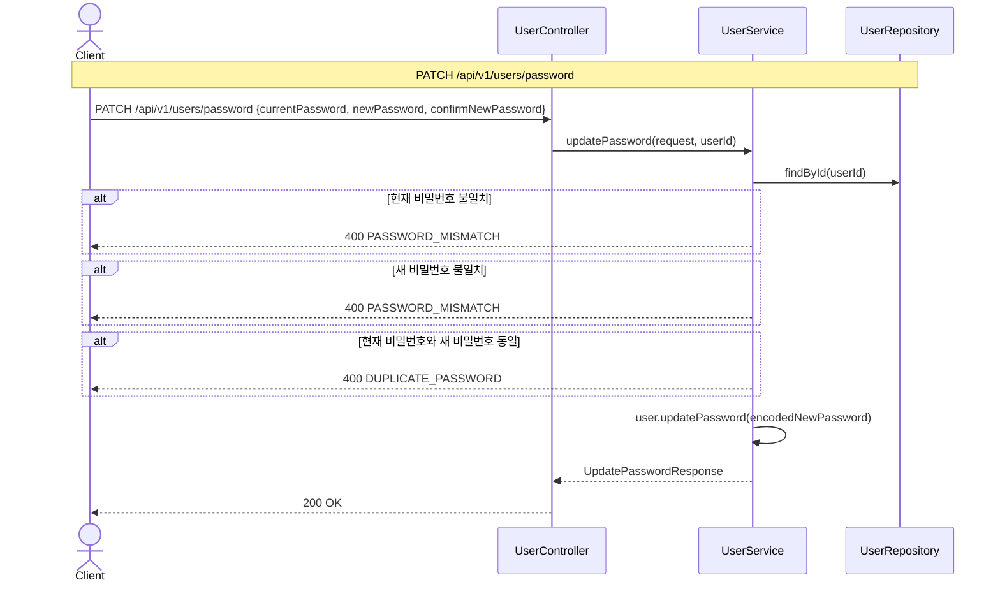
```mermaid
  sequenceDiagram
      actor Client
      participant UserController
      participant UserService
      participant UserRepository

      Note over Client,UserRepository: PATCH /api/v1/users/password
      Client->>UserController: PATCH /api/v1/users/password {currentPassword, newPassword, confirmNewPassword}
      UserController->>UserService: updatePassword(request, userId)
      UserService->>UserRepository: findById(userId)
      alt 현재 비밀번호 불일치
          UserService-->>Client: 400 PASSWORD_MISMATCH
      end
      alt 새 비밀번호 불일치
          UserService-->>Client: 400 PASSWORD_MISMATCH
      end
      alt 현재 비밀번호와 새 비밀번호 동일
          UserService-->>Client: 400 DUPLICATE_PASSWORD
      end
      UserService->>UserService: user.updatePassword(encodedNewPassword)
      UserService-->>UserController: UpdatePasswordResponse
      UserController-->>Client: 200 OK
```

### 5. 권한 변경
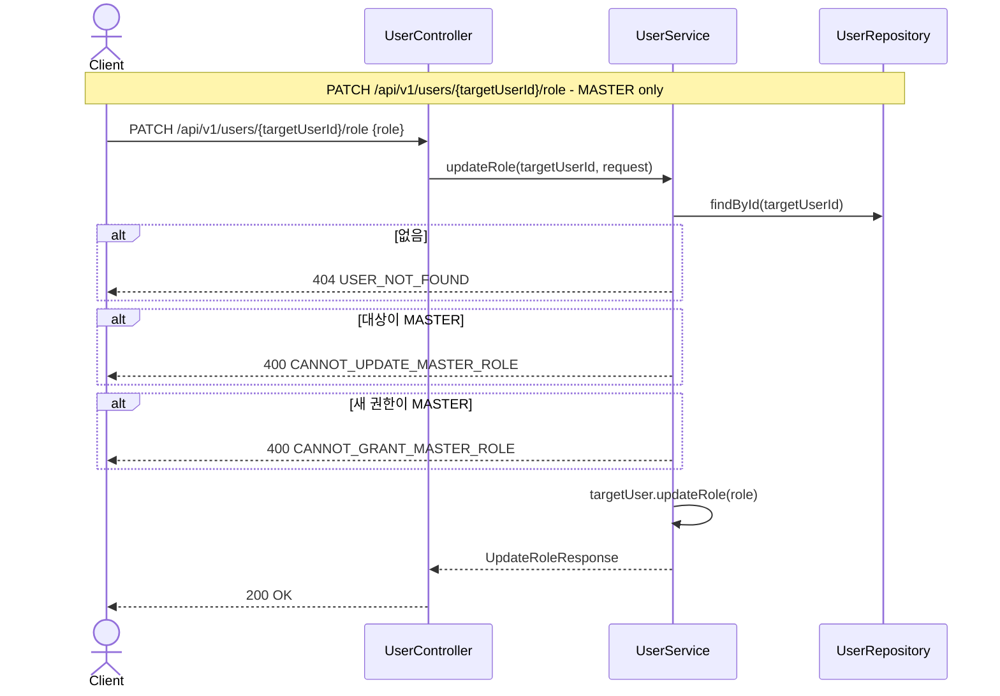
```mermaid
  sequenceDiagram
      actor Client
      participant UserController
      participant UserService
      participant UserRepository

      Note over Client,UserRepository: PATCH /api/v1/users/{targetUserId}/role - MASTER only
      Client->>UserController: PATCH /api/v1/users/{targetUserId}/role {role}
      UserController->>UserService: updateRole(targetUserId, request)
      UserService->>UserRepository: findById(targetUserId)
      alt 없음
          UserService-->>Client: 404 USER_NOT_FOUND
      end
      alt 대상이 MASTER
          UserService-->>Client: 400 CANNOT_UPDATE_MASTER_ROLE
      end
      alt 새 권한이 MASTER
          UserService-->>Client: 400 CANNOT_GRANT_MASTER_ROLE
      end
      UserService->>UserService: targetUser.updateRole(role)
      UserService-->>UserController: UpdateRoleResponse
      UserController-->>Client: 200 OK

```
### 6. 사용자 삭제:
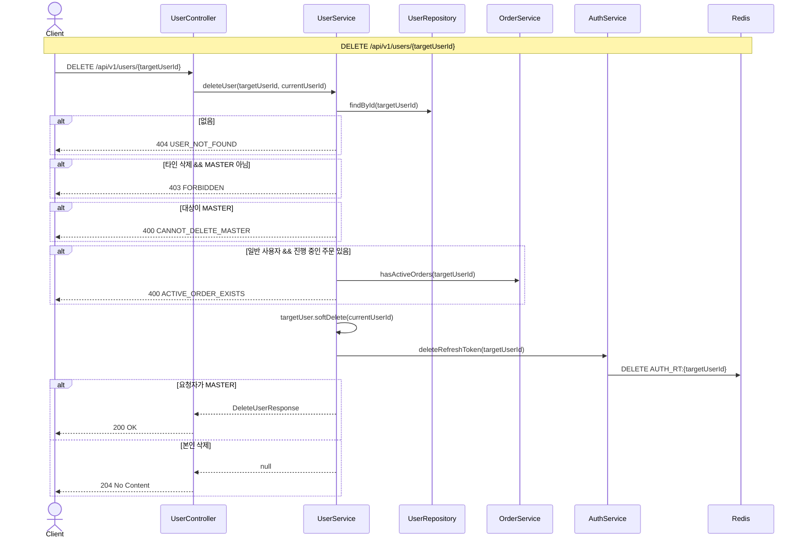
```mermaid
  sequenceDiagram
      actor Client
      participant UserController
      participant UserService
      participant UserRepository
      participant OrderService
      participant AuthService
      participant Redis

      Note over Client,Redis: DELETE /api/v1/users/{targetUserId}
      Client->>UserController: DELETE /api/v1/users/{targetUserId}
      UserController->>UserService: deleteUser(targetUserId, currentUserId)
      UserService->>UserRepository: findById(targetUserId)
      alt 없음
          UserService-->>Client: 404 USER_NOT_FOUND
      end
      alt 타인 삭제 && MASTER 아님
          UserService-->>Client: 403 FORBIDDEN
      end
      alt 대상이 MASTER
          UserService-->>Client: 400 CANNOT_DELETE_MASTER
      end
      alt 일반 사용자 && 진행 중인 주문 있음
          UserService->>OrderService: hasActiveOrders(targetUserId)
          UserService-->>Client: 400 ACTIVE_ORDER_EXISTS
      end
      UserService->>UserService: targetUser.softDelete(currentUserId)
      UserService->>AuthService: deleteRefreshToken(targetUserId)
      AuthService->>Redis: DELETE AUTH_RT:{targetUserId}
      alt 요청자가 MASTER
          UserService-->>UserController: DeleteUserResponse
          UserController-->>Client: 200 OK
      else 본인 삭제
          UserService-->>UserController: null
          UserController-->>Client: 204 No Content
      end
```
# 3. Address
### 1. 배송지 등록
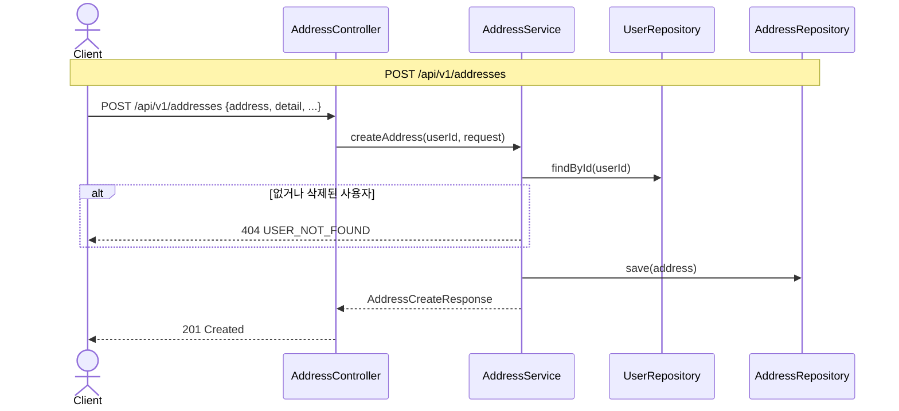
```mermaid
  sequenceDiagram
      actor Client
      participant AddressController
      participant AddressService
      participant UserRepository
      participant AddressRepository

      Note over Client,AddressRepository: POST /api/v1/addresses
      Client->>AddressController: POST /api/v1/addresses {address, detail, ...}
      AddressController->>AddressService: createAddress(userId, request)
      AddressService->>UserRepository: findById(userId)
      alt 없거나 삭제된 사용자
          AddressService-->>Client: 404 USER_NOT_FOUND
      end
      AddressService->>AddressRepository: save(address)
      AddressService-->>AddressController: AddressCreateResponse
      AddressController-->>Client: 201 Created
```
### 2. 배송지 목록 조회
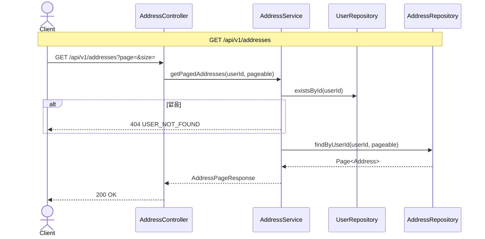
```mermaid
  sequenceDiagram
      actor Client
      participant AddressController
      participant AddressService
      participant UserRepository
      participant AddressRepository

      Note over Client,AddressRepository: GET /api/v1/addresses
      Client->>AddressController: GET /api/v1/addresses?page=&size=
      AddressController->>AddressService: getPagedAddresses(userId, pageable)
      AddressService->>UserRepository: existsById(userId)
      alt 없음
          AddressService-->>Client: 404 USER_NOT_FOUND
      end
      AddressService->>AddressRepository: findByUserId(userId, pageable)
      AddressRepository-->>AddressService: Page<Address>
      AddressService-->>AddressController: AddressPageResponse
      AddressController-->>Client: 200 OK

```
### 3. 배송지 상세 조회
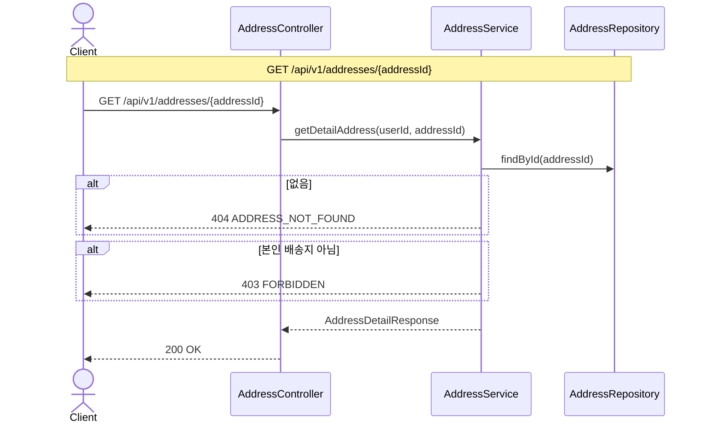
```mermaid
  sequenceDiagram
      actor Client
      participant AddressController
      participant AddressService
      participant AddressRepository

      Note over Client,AddressRepository: GET /api/v1/addresses/{addressId}
      Client->>AddressController: GET /api/v1/addresses/{addressId}
      AddressController->>AddressService: getDetailAddress(userId, addressId)
      AddressService->>AddressRepository: findById(addressId)
      alt 없음
          AddressService-->>Client: 404 ADDRESS_NOT_FOUND
      end
      alt 본인 배송지 아님
          AddressService-->>Client: 403 FORBIDDEN
      end
      AddressService-->>AddressController: AddressDetailResponse
      AddressController-->>Client: 200 OK
```
### 4. 배송지 수정
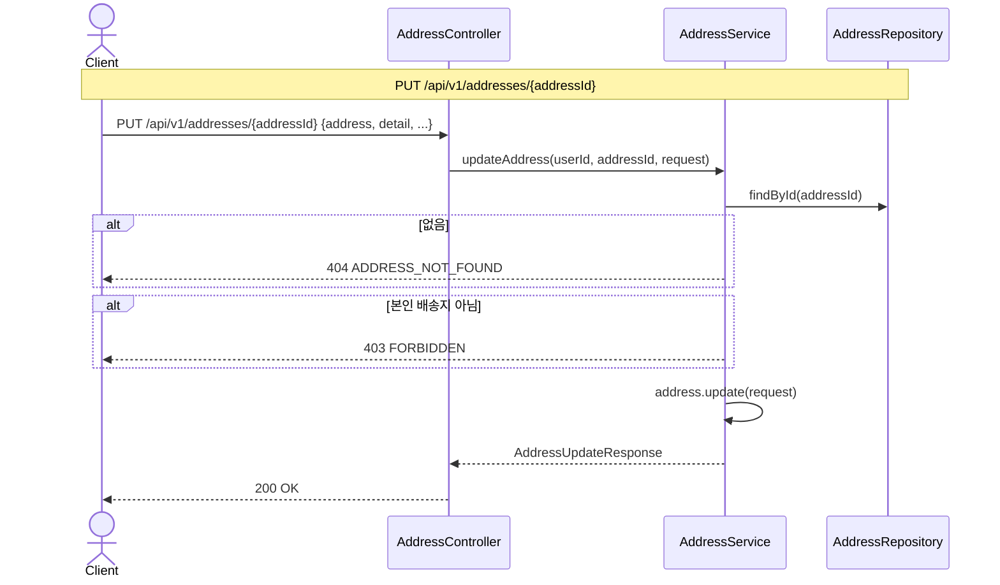
```mermaid
  sequenceDiagram
      actor Client
      participant AddressController
      participant AddressService
      participant AddressRepository

      Note over Client,AddressRepository: PUT /api/v1/addresses/{addressId}
      Client->>AddressController: PUT /api/v1/addresses/{addressId} {address, detail, ...}
      AddressController->>AddressService: updateAddress(userId, addressId, request)
      AddressService->>AddressRepository: findById(addressId)
      alt 없음
          AddressService-->>Client: 404 ADDRESS_NOT_FOUND
      end
      alt 본인 배송지 아님
          AddressService-->>Client: 403 FORBIDDEN
      end
      AddressService->>AddressService: address.update(request)
      AddressService-->>AddressController: AddressUpdateResponse
      AddressController-->>Client: 200 OK

```
### 5. 기본 배송지 설정
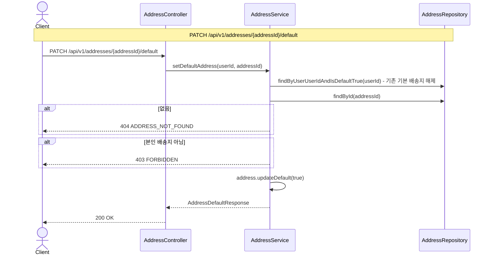
```mermaid
  sequenceDiagram
      actor Client
      participant AddressController
      participant AddressService
      participant AddressRepository

      Note over Client,AddressRepository: PATCH /api/v1/addresses/{addressId}/default
      Client->>AddressController: PATCH /api/v1/addresses/{addressId}/default
      AddressController->>AddressService: setDefaultAddress(userId, addressId)
      AddressService->>AddressRepository: findByUserUserIdAndIsDefaultTrue(userId) - 기존 기본 배송지 해제
      AddressService->>AddressRepository: findById(addressId)
      alt 없음
          AddressService-->>Client: 404 ADDRESS_NOT_FOUND
      end
      alt 본인 배송지 아님
          AddressService-->>Client: 403 FORBIDDEN
      end
      AddressService->>AddressService: address.updateDefault(true)
      AddressService-->>AddressController: AddressDefaultResponse
      AddressController-->>Client: 200 OK
```

### 6. 배송지 삭제
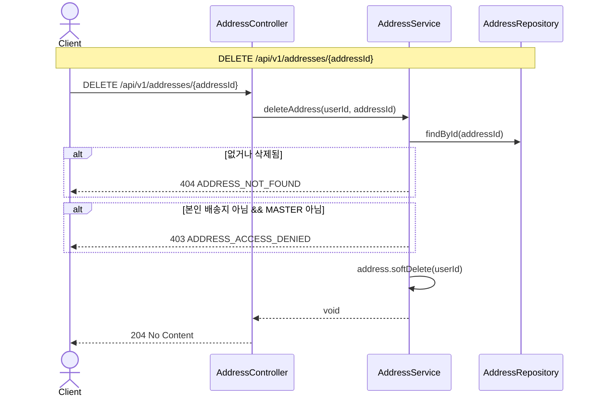
```mermaid
  sequenceDiagram
      actor Client
      participant AddressController
      participant AddressService
      participant AddressRepository

      Note over Client,AddressRepository: DELETE /api/v1/addresses/{addressId}
      Client->>AddressController: DELETE /api/v1/addresses/{addressId}
      AddressController->>AddressService: deleteAddress(userId, addressId)
      AddressService->>AddressRepository: findById(addressId)
      alt 없거나 삭제됨
          AddressService-->>Client: 404 ADDRESS_NOT_FOUND
      end
      alt 본인 배송지 아님 && MASTER 아님
          AddressService-->>Client: 403 ADDRESS_ACCESS_DENIED
      end
      AddressService->>AddressService: address.softDelete(userId)
      AddressService-->>AddressController: void
      AddressController-->>Client: 204 No Content
```
# 4. Store
### 1. 가게 생성
```mermaid
  sequenceDiagram
      actor Client
      participant StoreController
      participant StoreService
      participant AreaRepository
      participant UserRepository
      participant CategoryRepository
      participant StoreRepository

      Note over Client,StoreRepository: POST /api/v1/stores - OWNER only
      Client->>StoreController: POST /api/v1/stores {name, areaId, categoryId, ...}
      StoreController->>StoreService: createStore(request, userId)
      StoreService->>AreaRepository: findById(areaId)
      alt 없음
          StoreService-->>Client: 404 AREA_NOT_FOUND
      end
      alt 비활성화된 운영지역
          StoreService-->>Client: 400 AREA_INACTIVE
      end
      StoreService->>StoreService: normalizeStoreName(name)
      StoreService->>StoreRepository: existsByNameIgnoreCaseAndDeletedAtIsNull(name)
      alt 이름 중복
          StoreService-->>Client: 409 STORE_ALREADY_EXISTS
      end
      StoreService->>UserRepository: findById(userId)
      StoreService->>CategoryRepository: findById(categoryId)
      alt 없음
          StoreService-->>Client: 404 CATEGORY_NOT_FOUND
      end
      StoreService->>StoreRepository: save(store)
      StoreService-->>StoreController: StoreCreateResponse
      StoreController-->>Client: 201 Created
```
### 2. 가게 목록 조회
```mermaid
  sequenceDiagram
      actor Client
      participant StoreController
      participant StoreService
      participant StoreRepository

      Note over Client,StoreRepository: GET /api/v1/stores
      Client->>StoreController: GET /api/v1/stores?categoryName=&keyword=&page=&size=
      StoreController->>StoreService: getStores(categoryName, keyword, pageable, auth, userId)
      alt CUSTOMER / 비로그인
          StoreService->>StoreRepository: 공개 가게만 조회
      else OWNER
          StoreService->>StoreRepository: 본인 가게 + 공개 가게 조회
      else MANAGER / MASTER
          StoreService->>StoreRepository: 전체 조회
      end
      StoreRepository-->>StoreService: Page<Store>
      StoreService-->>StoreController: PageResponse<StoreResponse>
      StoreController-->>Client: 200 OK

```
### 3. 가게 단건 조회
```mermaid
  sequenceDiagram
      actor Client
      participant StoreController
      participant StoreService
      participant StoreRepository

      Note over Client,StoreRepository: GET /api/v1/stores/{storeId}
      Client->>StoreController: GET /api/v1/stores/{storeId}
      StoreController->>StoreService: getStore(storeId, userId, auth)
      StoreService->>StoreRepository: findByIdWithOwner(storeId)
      alt 없음
          StoreService-->>Client: 404 STORE_NOT_FOUND
      end
      alt hidden == false
          StoreService-->>StoreController: StoreResponse
      else hidden == true
          alt MANAGER/MASTER
              StoreService-->>StoreController: StoreResponse
          else OWNER && 본인 가게
              StoreService-->>StoreController: StoreResponse
          else CUSTOMER/비로그인 또는 타인 가게
              StoreService-->>Client: 404 STORE_NOT_VISIBLE
          end
      end
      StoreController-->>Client: 200 OK

```
### 4. 가게 수정:
```mermaid
  sequenceDiagram
      actor Client
      participant StoreController
      participant StoreService
      participant StoreRepository

      Note over Client,StoreRepository: PATCH /api/v1/stores/{storeId} - OWNER/MANAGER/MASTER
      Client->>StoreController: PATCH /api/v1/stores/{storeId} {name, address, phone}
      StoreController->>StoreService: updateStore(storeId, request, userId, auth)
      StoreService->>StoreRepository: findByIdWithOwner(storeId)
      alt 없음
          StoreService-->>Client: 404 STORE_NOT_FOUND
      end
      alt OWNER && 본인 가게 아님
          StoreService-->>Client: 403 STORE_FORBIDDEN
      end
      StoreService->>StoreService: normalizeStoreName(name)
      alt 이름 변경 && 중복 존재
          StoreService-->>Client: 409 STORE_ALREADY_EXISTS
      end
      StoreService->>StoreService: store.update(name, address, phone)
      StoreService-->>StoreController: StoreResponse
      StoreController-->>Client: 200 OK

```
### 5. 가게 삭제
```mermaid
  sequenceDiagram
      actor Client
      participant StoreController
      participant StoreService
      participant StoreRepository

      Note over Client,StoreRepository: DELETE /api/v1/stores/{storeId} - OWNER/MASTER
      Client->>StoreController: DELETE /api/v1/stores/{storeId}
      StoreController->>StoreService: deleteStore(storeId, userId, auth)
      StoreService->>StoreRepository: findByIdWithOwner(storeId)
      alt 없음
          StoreService-->>Client: 404 STORE_NOT_FOUND
      end
      alt OWNER && 본인 가게 아님
          StoreService-->>Client: 403 STORE_FORBIDDEN
      end
      StoreService->>StoreService: store.softDelete(userId)
      StoreService-->>StoreController: void
      StoreController-->>Client: 204 No Content
```
### 6. 가게 숨김
```mermaid
  sequenceDiagram
      actor Client
      participant StoreController
      participant StoreService
      participant StoreRepository

      Note over Client,StoreRepository: PATCH /api/v1/stores/{storeId}/hide - OWNER/MANAGER/MASTER
      Client->>StoreController: PATCH /api/v1/stores/{storeId}/hide {isHidden}
      StoreController->>StoreService: updateHidden(storeId, request, userId, auth)
      StoreService->>StoreRepository: findByIdWithOwner(storeId)
      alt 없음
          StoreService-->>Client: 404 STORE_NOT_FOUND
      end
      alt OWNER && 본인 가게 아님
          StoreService-->>Client: 403 STORE_FORBIDDEN
      end
      alt isHidden == true
          StoreService->>StoreService: store.hide()
      else isHidden == false
          StoreService->>StoreService: store.show()
      end
      StoreService-->>StoreController: StoreHiddenResponse
      StoreController-->>Client: 200 OK
```
# 5. Menu
### 1. 메뉴 등록
```mermaid
  sequenceDiagram
      actor Client
      participant MenuController
      participant MenuService
      participant CategoryRepository
      participant StoreRepository
      participant MenuRepository

      Note over Client,MenuRepository: POST /api/v1/stores/{storeId}/menus - OWNER/MANAGER/MASTER
      Client->>MenuController: POST /api/v1/stores/{storeId}/menus {name, price, categoryId, ...}
      MenuController->>MenuService: createMenu(storeId, request, userId)
      MenuService->>CategoryRepository: findById(categoryId)
      alt 없음
          MenuService-->>Client: 400 카테고리 없음
      end
      MenuService->>StoreRepository: findById(storeId)
      alt 없음
          MenuService-->>Client: 400 가게 없음
      end
      alt 본인 가게 아님
          MenuService-->>Client: 400 FORBIDDEN
      end
      MenuService->>MenuRepository: save(menu)
      MenuService-->>MenuController: MenuCreateResponse
      MenuController-->>Client: 201 Created
```
### 2. 메뉴 목록 조회 (고객용)
```mermaid
sequenceDiagram
    actor Client
    participant MenuController
    participant MenuService
    participant MenuRepository

    Note over Client,MenuRepository: GET /api/v1/stores/{storeId}/menus
    Client->>MenuController: GET /api/v1/stores/{storeId}/menus?keyword=&page=&size=
    MenuController->>MenuService: getMenusByStore(storeId, keyword, pageable)
    MenuService->>MenuRepository: 공개 메뉴만 조회 (hidden=false, soldOut=false)
    MenuRepository-->>MenuService: Page<Menu>
    MenuService-->>MenuController: MenuListResponse
    MenuController-->>Client: 200 OK
```

### 3. 메뉴 목록 조회 (사장님)
```mermaid
sequenceDiagram
    actor Client
    participant MenuController
    participant MenuService
    participant StoreRepository
    participant MenuRepository

    Note over Client,MenuRepository: GET /api/v1/stores/{storeId}/menus/owner - OWNER/MANAGER/MASTER
    Client->>MenuController: GET /api/v1/stores/{storeId}/menus/owner?keyword=&page=&size=
    MenuController->>MenuService: getOwnerMenusByStore(storeId, userId, keyword, pageable)
    MenuService->>StoreRepository: findById(storeId)
    alt 없음
        MenuService-->>Client: 400 가게 없음
    end
    alt 본인 가게 아님
        MenuService-->>Client: 400 FORBIDDEN
    end
    MenuService->>MenuRepository: findOwnerMenusByStoreId(storeId, keyword, pageable)
    MenuRepository-->>MenuService: Page<Menu>
    MenuService-->>MenuController: MenuListResponse
    MenuController-->>Client: 200 OK
```

### 4. 메뉴 상세 조회
```mermaid
sequenceDiagram
    actor Client
    participant MenuController
    participant MenuService
    participant MenuRepository

    Note over Client,MenuRepository: GET /api/v1/stores/{storeId}/menus/{menuId}
    Client->>MenuController: GET /api/v1/stores/{storeId}/menus/{menuId}
    MenuController->>MenuService: getMenuDetail(storeId, menuId)
    MenuService->>MenuRepository: findById(menuId)
    alt 없음
        MenuService-->>Client: 404 MENU_NOT_FOUND
    end
    MenuService-->>MenuController: MenuDetailResponse
    MenuController-->>Client: 200 OK
```

### 5. 메뉴 수정
```mermaid
sequenceDiagram
    actor Client
    participant MenuController
    participant MenuService
    participant MenuRepository

    Note over Client,MenuRepository: PATCH /api/v1/menus/{menuId} - OWNER/MANAGER/MASTER
    Client->>MenuController: PATCH /api/v1/menus/{menuId} {name, price, ...}
    MenuController->>MenuService: updateMenu(menuId, userId, request)
    MenuService->>MenuRepository: findById(menuId)
    alt 없음
        MenuService-->>Client: 400 메뉴 없음
    end
    alt 삭제된 메뉴
        MenuService-->>Client: 400 삭제된 메뉴입니다
    end
    alt 본인 가게 메뉴 아님
        MenuService-->>Client: 400 FORBIDDEN
    end
    MenuService->>MenuService: menu.update(request)
    MenuService-->>MenuController: MenuDetailResponse
    MenuController-->>Client: 200 OK
```

### 6. 메뉴 상태 변경
```mermaid
sequenceDiagram
    actor Client
    participant MenuController
    participant MenuService
    participant MenuRepository

    Note over Client,MenuRepository: PATCH /api/v1/menus/{menuId}/status - OWNER/MANAGER/MASTER
    Client->>MenuController: PATCH /api/v1/menus/{menuId}/status {isHidden, soldOut}
    MenuController->>MenuService: updateMenuStatus(menuId, userId, request)
    MenuService->>MenuRepository: findById(menuId)
    alt 없음
        MenuService-->>Client: 400 메뉴 없음
    end
    alt 삭제된 메뉴
        MenuService-->>Client: 400 삭제된 메뉴입니다
    end
    alt 본인 가게 메뉴 아님
        MenuService-->>Client: 400 FORBIDDEN
    end
    MenuService->>MenuService: menu.updateStatus(isHidden, soldOut)
    MenuService-->>MenuController: MenuDetailResponse
    MenuController-->>Client: 200 OK
```

### 7. 메뉴 삭제
```mermaid
sequenceDiagram
    actor Client
    participant MenuController
    participant MenuService
    participant MenuRepository

    Note over Client,MenuRepository: DELETE /api/v1/menus/{menuId} - OWNER/MANAGER/MASTER
    Client->>MenuController: DELETE /api/v1/menus/{menuId}
    MenuController->>MenuService: deleteMenu(menuId, userId)
    MenuService->>MenuRepository: findById(menuId)
    alt 없음
        MenuService-->>Client: 400 메뉴 없음
    end
    alt 삭제된 메뉴
        MenuService-->>Client: 400 삭제된 메뉴입니다
    end
    alt 본인 가게 메뉴 아님
        MenuService-->>Client: 400 FORBIDDEN
    end
    MenuService->>MenuService: menu.delete(userId)
    MenuService-->>MenuController: void
    MenuController-->>Client: 200 OK
```

# 6. Category

### 1. 카테고리 생성
```mermaid
sequenceDiagram
    actor Client
    participant CategoryController
    participant CategoryService
    participant CategoryRepository

    Note over Client,CategoryRepository: POST /api/v1/categories - MANAGER/MASTER
    Client->>CategoryController: POST /api/v1/categories {name}
    CategoryController->>CategoryService: createCategory(request)
    CategoryService->>CategoryService: normalizeName(name)
    alt 이름 null 또는 공백
        CategoryService-->>Client: 400 INVALID_CATEGORY_NAME
    end
    CategoryService->>CategoryRepository: existsByNameIgnoreCaseAndDeletedAtIsNull(name)
    alt 이름 중복
        CategoryService-->>Client: 409 CATEGORY_ALREADY_EXISTS
    end
    CategoryService->>CategoryRepository: save(category)
    CategoryService-->>CategoryController: CategoryCreateResponse
    CategoryController-->>Client: 201 Created
```

### 2. 카테고리 목록 조회
```mermaid
sequenceDiagram
    actor Client
    participant CategoryController
    participant CategoryService
    participant CategoryRepository

    Note over Client,CategoryRepository: GET /api/v1/categories
    Client->>CategoryController: GET /api/v1/categories?keyword=&page=&size=
    CategoryController->>CategoryService: getCategories(keyword, pageable)
    CategoryService->>CategoryRepository: findByKeyword(keyword, pageable)
    CategoryRepository-->>CategoryService: Page<Category>
    CategoryService-->>CategoryController: PageResponse<CategoryResponse>
    CategoryController-->>Client: 200 OK
```

### 3. 카테고리 상세 조회
```mermaid
sequenceDiagram
    actor Client
    participant CategoryController
    participant CategoryService
    participant CategoryRepository

    Note over Client,CategoryRepository: GET /api/v1/categories/{categoryId}
    Client->>CategoryController: GET /api/v1/categories/{categoryId}
    CategoryController->>CategoryService: getCategory(categoryId)
    CategoryService->>CategoryRepository: findById(categoryId)
    alt 없음
        CategoryService-->>Client: 404 CATEGORY_NOT_FOUND
    end
    CategoryService-->>CategoryController: CategoryResponse
    CategoryController-->>Client: 200 OK
```

### 4. 카테고리 수정
```mermaid
sequenceDiagram
    actor Client
    participant CategoryController
    participant CategoryService
    participant CategoryRepository

    Note over Client,CategoryRepository: PUT /api/v1/categories/{categoryId} - MANAGER/MASTER
    Client->>CategoryController: PUT /api/v1/categories/{categoryId} {name}
    CategoryController->>CategoryService: updateCategory(categoryId, request)
    CategoryService->>CategoryRepository: findById(categoryId)
    alt 없음
        CategoryService-->>Client: 404 CATEGORY_NOT_FOUND
    end
    CategoryService->>CategoryService: normalizeName(name)
    alt 이름 변경 && 중복 존재
        CategoryService-->>Client: 409 CATEGORY_ALREADY_EXISTS
    end
    CategoryService->>CategoryService: category.updateName(name)
    CategoryService-->>CategoryController: CategoryResponse
    CategoryController-->>Client: 200 OK
```

### 5. 카테고리 삭제
```mermaid
sequenceDiagram
    actor Client
    participant CategoryController
    participant CategoryService
    participant CategoryRepository
    participant StoreRepository

    Note over Client,StoreRepository: DELETE /api/v1/categories/{categoryId} - MASTER
    Client->>CategoryController: DELETE /api/v1/categories/{categoryId}
    CategoryController->>CategoryService: deleteCategory(categoryId, userId)
    CategoryService->>CategoryRepository: findById(categoryId)
    alt 없음
        CategoryService-->>Client: 404 CATEGORY_NOT_FOUND
    end
    CategoryService->>StoreRepository: existsByCategoryIdAndDeletedAtIsNull(categoryId)
    alt 연관 가게 존재
        CategoryService-->>Client: 400 CATEGORY_HAS_STORES
    end
    CategoryService->>CategoryService: category.softDelete(userId)
    CategoryService-->>CategoryController: void
    CategoryController-->>Client: 204 No Content
```

# 7. Area

### 1. 운영지역 생성
```mermaid
sequenceDiagram
    actor Client
    participant AreaController
    participant AreaService
    participant AreaRepository

    Note over Client,AreaRepository: POST /api/v1/areas - MANAGER/MASTER
    Client->>AreaController: POST /api/v1/areas {name, city, district}
    AreaController->>AreaService: createArea(request)
    AreaService->>AreaService: normalizeName(name)
    alt 이름 null 또는 공백
        AreaService-->>Client: 400 INVALID_AREA_NAME
    end
    AreaService->>AreaRepository: existsByNameIgnoreCaseAndDeletedAtIsNull(name)
    alt 이름 중복
        AreaService-->>Client: 409 AREA_ALREADY_EXISTS
    end
    AreaService->>AreaRepository: save(area)
    AreaService-->>AreaController: AreaCreateResponse
    AreaController-->>Client: 201 Created
```

### 2. 운영지역 목록 조회
```mermaid
sequenceDiagram
    actor Client
    participant AreaController
    participant AreaService
    participant AreaRepository

    Note over Client,AreaRepository: GET /api/v1/areas
    Client->>AreaController: GET /api/v1/areas?keyword=&page=&size=
    AreaController->>AreaService: getAreas(keyword, pageable)
    AreaService->>AreaRepository: findByKeyword(keyword, pageable)
    AreaRepository-->>AreaService: Page<Area>
    AreaService-->>AreaController: PageResponse<AreaResponse>
    AreaController-->>Client: 200 OK
```

### 3. 운영지역 상세 조회
```mermaid
sequenceDiagram
    actor Client
    participant AreaController
    participant AreaService
    participant AreaRepository

    Note over Client,AreaRepository: GET /api/v1/areas/{areaId}
    Client->>AreaController: GET /api/v1/areas/{areaId}
    AreaController->>AreaService: getArea(areaId)
    AreaService->>AreaRepository: findById(areaId)
    alt 없음
        AreaService-->>Client: 404 AREA_NOT_FOUND
    end
    AreaService-->>AreaController: AreaResponse
    AreaController-->>Client: 200 OK
```

### 4. 운영지역 수정
```mermaid
sequenceDiagram
    actor Client
    participant AreaController
    participant AreaService
    participant AreaRepository

    Note over Client,AreaRepository: PUT /api/v1/areas/{areaId} - MANAGER/MASTER
    Client->>AreaController: PUT /api/v1/areas/{areaId} {name, city, district, isActive}
    AreaController->>AreaService: updateArea(areaId, request)
    AreaService->>AreaRepository: findById(areaId)
    alt 없음
        AreaService-->>Client: 404 AREA_NOT_FOUND
    end
    AreaService->>AreaService: normalizeName(name)
    alt 이름 변경 && 중복 존재
        AreaService-->>Client: 409 AREA_ALREADY_EXISTS
    end
    AreaService->>AreaService: area.update(name, city, district, isActive)
    AreaService-->>AreaController: AreaResponse
    AreaController-->>Client: 200 OK
```

### 5. 운영지역 삭제
```mermaid
sequenceDiagram
    actor Client
    participant AreaController
    participant AreaService
    participant AreaRepository
    participant StoreRepository

    Note over Client,StoreRepository: DELETE /api/v1/areas/{areaId} - MASTER
    Client->>AreaController: DELETE /api/v1/areas/{areaId}
    AreaController->>AreaService: deleteArea(areaId, userId)
    AreaService->>AreaRepository: findById(areaId)
    alt 없음
        AreaService-->>Client: 404 AREA_NOT_FOUND
    end
    AreaService->>StoreRepository: existsByAreaIdAndDeletedAtIsNull(areaId)
    alt 연관 가게 존재
        AreaService-->>Client: 400 AREA_HAS_STORES
    end
    AreaService->>AreaService: area.softDelete(userId)
    AreaService-->>AreaController: void
    AreaController-->>Client: 204 No Content
```

# 8. Order

### 1. 주문 생성
```mermaid
sequenceDiagram
    actor Client
    participant OrderController
    participant OrderService
    participant StoreRepository
    participant AddressRepository
    participant MenuRepository
    participant OrderRepository
    participant PaymentService

    Note over Client,PaymentService: POST /api/v1/orders
    Client->>OrderController: POST /api/v1/orders
    OrderController->>OrderService: createOrder(request, userId, role)
    alt role != CUSTOMER
        OrderService-->>Client: 403 FORBIDDEN
    end
    OrderService->>StoreRepository: findById(storeId)
    alt 없거나 hidden
        OrderService-->>Client: 404 STORE_NOT_FOUND
    end
    OrderService->>AddressRepository: findActiveById(addressId)
    alt 없음
        OrderService-->>Client: 404 ADDRESS_NOT_FOUND
    end
    alt 본인 주소 아님
        OrderService-->>Client: 403 FORBIDDEN
    end
    loop 주문 항목마다
        OrderService->>MenuRepository: findActiveById(menuId)
        alt 없음(삭제/hidden/soldOut)
            OrderService-->>Client: 404 MENU_NOT_FOUND
        end
        alt 가게 소속 아님
            OrderService-->>Client: 400 MENU_NOT_IN_STORE
        end
    end
    OrderService->>OrderRepository: save(order)
    OrderService->>PaymentService: createPayment(orderId, userId, CARD)
    PaymentService-->>OrderService: PaymentCreateResponse
    alt status != COMPLETED
        OrderService-->>Client: 400 PAYMENT_FAILED
    end
    OrderService-->>OrderController: CreateOrderResponse
    OrderController-->>Client: 201 Created
```

### 2. 주문 목록 조회
```mermaid
sequenceDiagram
    actor Client
    participant OrderController
    participant OrderService
    participant OrderRepository

    Note over Client,OrderRepository: GET /api/v1/orders
    Client->>OrderController: GET /api/v1/orders?status=&storeName=&page=&size=
    OrderController->>OrderService: getOrders(userId, status, storeName, pageable, role)
    alt CUSTOMER
        OrderService->>OrderRepository: searchOrders(userId, ...)
    else OWNER
        OrderService->>OrderRepository: searchOrdersByStoreOwner(userId, ...)
    else MANAGER
        OrderService->>OrderRepository: searchAllOrders(...)
    else MASTER
        OrderService->>OrderRepository: searchAllOrdersIncludeDeleted(...)
    else 그 외
        OrderService-->>Client: 403 FORBIDDEN
    end
    OrderRepository-->>OrderService: Page<Order>
    OrderService-->>OrderController: Page<OrderSummaryResponse>
    OrderController-->>Client: 200 OK
```

### 3. 주문 단건 조회
```mermaid
sequenceDiagram
    actor Client
    participant OrderController
    participant OrderService
    participant OrderRepository
    participant StoreRepository

    Note over Client,StoreRepository: GET /api/v1/orders/{orderId}
    Client->>OrderController: GET /api/v1/orders/{orderId}
    OrderController->>OrderService: getOrder(orderId, userId, role)
    alt MASTER
        OrderService->>OrderRepository: findById(orderId)
    else CUSTOMER / OWNER / MANAGER
        OrderService->>OrderRepository: findActiveById(orderId)
    end
    alt 없음
        OrderService-->>Client: 404 ORDER_NOT_FOUND
    end
    alt CUSTOMER && 본인 아님
        OrderService-->>Client: 403 FORBIDDEN
    else OWNER
        OrderService->>StoreRepository: findById(storeId)
        alt 본인 가게 아님
            OrderService-->>Client: 403 FORBIDDEN
        end
    end
    OrderService-->>OrderController: OrderDetailResponse
    OrderController-->>Client: 200 OK
```

### 4. 주문 요청사항 수정
```mermaid
sequenceDiagram
    actor Client
    participant OrderController
    participant OrderService
    participant OrderRepository

    Note over Client,OrderRepository: PUT /api/v1/orders/{orderId}
    Client->>OrderController: PUT /api/v1/orders/{orderId} {note}
    OrderController->>OrderService: updateOrder(orderId, request, userId, role)
    alt role != CUSTOMER
        OrderService-->>Client: 403 FORBIDDEN
    end
    OrderService->>OrderRepository: findActiveById(orderId)
    alt 없음
        OrderService-->>Client: 404 ORDER_NOT_FOUND
    end
    alt 본인 주문 아님
        OrderService-->>Client: 403 FORBIDDEN
    end
    OrderService->>OrderService: order.updateNote(note)
    alt PENDING 상태 아님
        OrderService-->>Client: 400 ORDER_UPDATE_NOT_ALLOWED
    end
    OrderService-->>OrderController: UpdateOrderResponse
    OrderController-->>Client: 200 OK
```

### 5. 주문 상태 변경
```mermaid
sequenceDiagram
    actor Client
    participant OrderController
    participant OrderService
    participant OrderRepository
    participant StoreRepository

    Note over Client,StoreRepository: PATCH /api/v1/orders/{orderId}/status
    Client->>OrderController: PATCH /api/v1/orders/{orderId}/status {status}
    OrderController->>OrderService: updateOrderStatus(orderId, request, userId, role)
    alt role == CUSTOMER
        OrderService-->>Client: 403 FORBIDDEN
    end
    OrderService->>OrderRepository: findActiveById(orderId)
    alt 없음
        OrderService-->>Client: 404 ORDER_NOT_FOUND
    end
    alt OWNER
        OrderService->>StoreRepository: findById(storeId)
        alt 본인 가게 아님
            OrderService-->>Client: 403 FORBIDDEN
        end
    else MANAGER / MASTER
        Note right of OrderService: 추가 검증 없음
    end
    OrderService->>OrderService: validateStatusTransition(newStatus)
    alt 허용되지 않은 전이
        OrderService-->>Client: 400 INVALID_STATUS_TRANSITION
    end
    OrderService->>OrderRepository: updateStatusConditionally(orderId, oldStatus, newStatus)
    alt rows == 0
        OrderService-->>Client: 409 ORDER_CONFLICT
    end
    OrderService->>OrderRepository: findActiveById(orderId)
    OrderService-->>OrderController: UpdateOrderStatusResponse
    OrderController-->>Client: 200 OK
```

### 6. 주문 취소
```mermaid
sequenceDiagram
    actor Client
    participant OrderController
    participant OrderService
    participant OrderRepository
    participant PaymentService

    Note over Client,PaymentService: PATCH /api/v1/orders/{orderId}/cancel
    Client->>OrderController: PATCH /api/v1/orders/{orderId}/cancel {cancelReason}
    OrderController->>OrderService: cancelOrder(orderId, request, userId, role)
    alt role != CUSTOMER && role != MASTER
        OrderService-->>Client: 403 FORBIDDEN
    end
    OrderService->>OrderRepository: findActiveById(orderId)
    alt 없음
        OrderService-->>Client: 404 ORDER_NOT_FOUND
    end
    alt CUSTOMER && 본인 아님
        OrderService-->>Client: 403 FORBIDDEN
    end
    OrderService->>OrderService: order.cancelByCustomer() - PENDING 상태 및 5분 검증
    alt PENDING 아님
        OrderService-->>Client: 400 ORDER_CANCEL_NOT_ALLOWED
    end
    alt 5분 초과
        OrderService-->>Client: 400 CANCEL_TIME_EXCEEDED
    end
    OrderService->>OrderRepository: cancelConditionally(orderId, cancelReason)
    alt rows == 0
        OrderService->>OrderRepository: findActiveById(orderId)
        alt 5분 초과
            OrderService-->>Client: 400 CANCEL_TIME_EXCEEDED
        else
            OrderService-->>Client: 409 ORDER_CONFLICT
        end
    end
    OrderService->>PaymentService: refundIfPossible(orderId)
    PaymentService-->>OrderService: void
    OrderService->>OrderRepository: findActiveById(orderId)
    OrderService-->>OrderController: CancelOrderResponse
    OrderController-->>Client: 200 OK
```

### 7. 주문 거절
```mermaid
sequenceDiagram
    actor Client
    participant OrderController
    participant OrderService
    participant OrderRepository
    participant StoreRepository
    participant PaymentService

    Note over Client,PaymentService: PATCH /api/v1/orders/{orderId}/reject
    Client->>OrderController: PATCH /api/v1/orders/{orderId}/reject {rejectReason}
    OrderController->>OrderService: rejectOrder(orderId, request, userId, role)
    alt role == CUSTOMER
        OrderService-->>Client: 403 FORBIDDEN
    end
    OrderService->>OrderRepository: findActiveById(orderId)
    alt 없음
        OrderService-->>Client: 404 ORDER_NOT_FOUND
    end
    alt OWNER
        OrderService->>StoreRepository: findById(storeId)
        alt 본인 가게 아님
            OrderService-->>Client: 403 FORBIDDEN
        end
    else MANAGER / MASTER
        Note right of OrderService: 추가 검증 없음
    end
    OrderService->>OrderService: rejectByOwner() - PENDING 검증
    alt PENDING 아님
        OrderService-->>Client: 400 INVALID_STATUS
    end
    OrderService->>OrderRepository: rejectConditionally(orderId, rejectReason)
    alt rows == 0
        OrderService-->>Client: 409 ORDER_CONFLICT
    end
    OrderService->>PaymentService: refundIfPossible(orderId)
    PaymentService-->>OrderService: void
    OrderService->>OrderRepository: findActiveById(orderId)
    OrderService-->>OrderController: RejectOrderResponse
    OrderController-->>Client: 200 OK
```

### 8. 주문 삭제
```mermaid
sequenceDiagram
    actor Client
    participant OrderController
    participant OrderService
    participant OrderRepository
    participant PaymentService

    Note over Client,PaymentService: DELETE /api/v1/orders/{orderId} - MASTER only
    Client->>OrderController: DELETE /api/v1/orders/{orderId}
    OrderController->>OrderService: deleteOrder(orderId, userId, role)
    alt role != MASTER
        OrderService-->>Client: 403 FORBIDDEN
    end
    OrderService->>OrderRepository: findActiveById(orderId)
    alt 없음
        OrderService-->>Client: 404 ORDER_NOT_FOUND
    end
    OrderService->>PaymentService: refundIfPossible(orderId)
    Note right of PaymentService: PAYMENT_NOT_FOUND / INVALID_PAYMENT_STATUS 무시
    PaymentService-->>OrderService: void
    OrderService->>OrderService: order.delete(userId)
    OrderService-->>OrderController: void
    OrderController-->>Client: 204 No Content
```

# 9. Payment

### 1. 결제 처리
```mermaid
sequenceDiagram
    actor Client
    participant PaymentController
    participant PaymentService
    participant OrderRepository
    participant PaymentRepository

    Note over Client,PaymentRepository: POST /api/v1/orders/{orderId}/payments
    Client->>PaymentController: POST /api/v1/orders/{orderId}/payments {paymentMethod}
    PaymentController->>PaymentService: createPayment(orderId, userId, request)
    PaymentService->>OrderRepository: findByIdWithLock(orderId)
    alt 없음
        PaymentService-->>Client: 404 ORDER_NOT_FOUND
    end
    PaymentService->>PaymentRepository: findByOrder_OrderIdAndDeletedAtIsNull(orderId)
    alt 이미 결제 존재
        PaymentService-->>Client: 409 PAYMENT_ALREADY_EXISTS
    end
    alt 본인 주문 아님
        PaymentService-->>Client: 403 ORDER_ACCESS_DENIED
    end
    alt CANCELED 상태
        PaymentService-->>Client: 400 ORDER_ALREADY_CANCELLED
    end
    PaymentService->>PaymentRepository: save(payment)
    PaymentService->>PaymentService: payment.updateStatus(COMPLETED)
    PaymentService-->>PaymentController: PaymentCreateResponse
    PaymentController-->>Client: 201 Created
```

### 2. 결제 목록 조회
```mermaid
sequenceDiagram
    actor Client
    participant PaymentController
    participant PaymentService
    participant PaymentRepository

    Note over Client,PaymentRepository: GET /api/v1/payments
    Client->>PaymentController: GET /api/v1/payments?userId=&page=&size=
    PaymentController->>PaymentService: getPagedPayments(userId, targetUserId, pageable)
    alt 본인 조회
        PaymentService->>PaymentRepository: findByUserId(userId, pageable)
    else 타인 조회
        PaymentService->>PaymentService: validateAdmin(userId)
        alt MANAGER/MASTER 아님
            PaymentService-->>Client: 403 FORBIDDEN
        end
        PaymentService->>PaymentRepository: findByUserId(targetUserId, pageable)
    end
    PaymentRepository-->>PaymentService: Page<Payment>
    PaymentService-->>PaymentController: PaymentPageResponse
    PaymentController-->>Client: 200 OK
```

### 3. 결제 상세 조회
```mermaid
sequenceDiagram
    actor Client
    participant PaymentController
    participant PaymentService
    participant PaymentRepository

    Note over Client,PaymentRepository: GET /api/v1/payments/{paymentId}
    Client->>PaymentController: GET /api/v1/payments/{paymentId}
    PaymentController->>PaymentService: getPaymentDetails(userId, paymentId)
    PaymentService->>PaymentRepository: findByIdAndOrder_CustomerIdAndDeletedAtIsNull(paymentId, userId)
    alt 본인 결제내역 없음 → 관리자 권한 확인
        PaymentService->>PaymentService: validateAdmin(userId)
        alt MANAGER/MASTER 아님
            PaymentService-->>Client: 403 FORBIDDEN
        end
        PaymentService->>PaymentRepository: findById(paymentId)
        alt 없음
            PaymentService-->>Client: 404 PAYMENT_NOT_FOUND
        end
    end
    alt 삭제된 결제내역
        PaymentService-->>Client: 404 PAYMENT_NOT_FOUND
    end
    PaymentService-->>PaymentController: PaymentDetailResponse
    PaymentController-->>Client: 200 OK
```

### 4. 결제 상태 변경
```mermaid
sequenceDiagram
    actor Client
    participant PaymentController
    participant PaymentService
    participant PaymentRepository

    Note over Client,PaymentRepository: PUT /api/v1/payments/{paymentId} - MANAGER/MASTER
    Client->>PaymentController: PUT /api/v1/payments/{paymentId} {status}
    PaymentController->>PaymentService: changePaymentStatus(paymentId, userId, request)
    PaymentService->>PaymentService: validateAdmin(userId)
    alt MANAGER/MASTER 아님
        PaymentService-->>Client: 403 FORBIDDEN
    end
    PaymentService->>PaymentRepository: findById(paymentId)
    alt 없거나 삭제됨
        PaymentService-->>Client: 404 PAYMENT_NOT_FOUND
    end
    PaymentService->>PaymentService: payment.updateStatus(status)
    PaymentService-->>PaymentController: PaymentUpdateResponse
    PaymentController-->>Client: 200 OK
```

### 5. 결제 삭제
```mermaid
sequenceDiagram
    actor Client
    participant PaymentController
    participant PaymentService
    participant PaymentRepository

    Note over Client,PaymentRepository: DELETE /api/v1/payments/{paymentId} - MASTER
    Client->>PaymentController: DELETE /api/v1/payments/{paymentId}
    PaymentController->>PaymentService: deletePayment(paymentId, userId)
    PaymentService->>PaymentService: validateMaster(userId)
    alt MASTER 아님
        PaymentService-->>Client: 403 FORBIDDEN
    end
    PaymentService->>PaymentRepository: findById(paymentId)
    alt 없음
        PaymentService-->>Client: 404 PAYMENT_NOT_FOUND
    end
    PaymentService->>PaymentService: payment.softDelete(userId)
    PaymentService-->>PaymentController: void
    PaymentController-->>Client: 204 No Content
```

# 10. Review

### 1. 리뷰 등록
```mermaid
sequenceDiagram
    actor Client
    participant ReviewController
    participant ReviewService
    participant OrderRepository
    participant UserRepository
    participant StoreRepository
    participant ReviewRepository

    Note over Client,ReviewRepository: POST /api/v1/orders/{orderId}/reviews
    Client->>ReviewController: POST /api/v1/orders/{orderId}/reviews {rating, content}
    ReviewController->>ReviewService: createReview(orderId, userId, request)
    ReviewService->>OrderRepository: findById(orderId)
    alt 없음
        ReviewService-->>Client: 404 ORDER_NOT_FOUND
    end
    alt 본인 주문 아님
        ReviewService-->>Client: 403 ORDER_ACCESS_DENIED
    end
    ReviewService->>UserRepository: findById(userId)
    alt 없음
        ReviewService-->>Client: 404 USER_NOT_FOUND
    end
    ReviewService->>StoreRepository: findById(order.storeId)
    alt 없음
        ReviewService-->>Client: 404 STORE_NOT_FOUND
    end
    ReviewService->>ReviewRepository: save(review)
    ReviewService-->>ReviewController: ReviewCreateResponse
    ReviewController-->>Client: 201 Created
```

### 2. 리뷰 목록 조회
```mermaid
sequenceDiagram
    actor Client
    participant ReviewController
    participant ReviewService
    participant ReviewRepository

    Note over Client,ReviewRepository: GET /api/v1/reviews
    Client->>ReviewController: GET /api/v1/reviews?userId=&page=&size=
    ReviewController->>ReviewService: getPagedReviews(userId, targetUserId, role, pageable)
    alt CUSTOMER 본인 조회
        ReviewService->>ReviewRepository: findByUserId(userId, pageable)
    else 타인 조회 && MANAGER/MASTER
        ReviewService->>ReviewRepository: findByUserId(targetUserId, pageable)
    else 권한 없음
        ReviewService-->>Client: 403 FORBIDDEN
    end
    ReviewRepository-->>ReviewService: Page<Review>
    ReviewService-->>ReviewController: ReviewPageResponse
    ReviewController-->>Client: 200 OK
```

### 3. 가게 리뷰 조회
```mermaid
sequenceDiagram
    actor Client
    participant ReviewController
    participant ReviewService
    participant StoreRepository
    participant ReviewRepository

    Note over Client,ReviewRepository: GET /api/v1/stores/{storeId}/reviews
    Client->>ReviewController: GET /api/v1/stores/{storeId}/reviews?page=&size=
    ReviewController->>ReviewService: getStoreReviews(storeId, pageable)
    ReviewService->>StoreRepository: existsById(storeId)
    alt 없음
        ReviewService-->>Client: 404 STORE_NOT_FOUND
    end
    ReviewService->>ReviewRepository: findByStoreId(storeId, pageable)
    ReviewRepository-->>ReviewService: Page<Review>
    ReviewService-->>ReviewController: ReviewPageResponse
    ReviewController-->>Client: 200 OK
```

### 4. 리뷰 상세 조회
```mermaid
sequenceDiagram
    actor Client
    participant ReviewController
    participant ReviewService
    participant ReviewRepository

    Note over Client,ReviewRepository: GET /api/v1/reviews/{reviewId}
    Client->>ReviewController: GET /api/v1/reviews/{reviewId}
    ReviewController->>ReviewService: getDetailReview(reviewId)
    ReviewService->>ReviewRepository: getReviewById(reviewId)
    alt 없음
        ReviewService-->>Client: 404 REVIEW_NOT_FOUND
    end
    ReviewService-->>ReviewController: ReviewDetailResponse
    ReviewController-->>Client: 200 OK
```

### 5. 리뷰 수정
```mermaid
sequenceDiagram
    actor Client
    participant ReviewController
    participant ReviewService
    participant ReviewRepository

    Note over Client,ReviewRepository: PUT /api/v1/reviews/{reviewId}
    Client->>ReviewController: PUT /api/v1/reviews/{reviewId} {rating, content}
    ReviewController->>ReviewService: updateReview(reviewId, userId, request)
    ReviewService->>ReviewRepository: getReviewById(reviewId)
    alt 없음
        ReviewService-->>Client: 404 REVIEW_NOT_FOUND
    end
    alt 본인 리뷰 아님
        ReviewService-->>Client: 403 FORBIDDEN
    end
    ReviewService->>ReviewService: review.update(rating, content)
    ReviewService-->>ReviewController: ReviewUpdateResponse
    ReviewController-->>Client: 200 OK
```

### 6. 리뷰 삭제
```mermaid
sequenceDiagram
    actor Client
    participant ReviewController
    participant ReviewService
    participant ReviewRepository

    Note over Client,ReviewRepository: DELETE /api/v1/reviews/{reviewId}
    Client->>ReviewController: DELETE /api/v1/reviews/{reviewId}
    ReviewController->>ReviewService: deleteReview(reviewId, userId)
    ReviewService->>ReviewRepository: getReviewById(reviewId)
    alt 없음
        ReviewService-->>Client: 404 REVIEW_NOT_FOUND
    end
    alt 본인 아님 && MASTER 아님
        ReviewService-->>Client: 403 REVIEW_ACCESS_DENIED
    end
    ReviewService->>ReviewService: review.softDelete(userId)
    ReviewService-->>ReviewController: void
    ReviewController-->>Client: 204 No Content
```

# 11. AI

### 1. 상품 설명 생성
```mermaid
sequenceDiagram
    actor Client
    participant AiController
    participant AiService
    participant GeminiAPI
    participant AiRequestLogRepository

    Note over Client,AiRequestLogRepository: POST /api/v1/ai/product-description - OWNER only
    Client->>AiController: POST /api/v1/ai/product-description {prompt}
    AiController->>AiService: generateProductDescription(prompt, userId)
    AiService->>AiService: requestPrompt = prompt + " 답변을 최대한 간결하게 50자 이하로"
    AiService->>GeminiAPI: generateContent(requestPrompt)
    alt API 호출 실패
        AiService-->>Client: 500 INTERNAL_SERVER_ERROR
    end
    GeminiAPI-->>AiService: 생성된 설명 텍스트
    alt 응답이 null 또는 빈값
        AiService-->>Client: 500 AI_RESPONSE_EMPTY
    end
    AiService->>AiService: response.trim() + 50자 초과 시 substring(0, 50)
    AiService->>AiRequestLogRepository: save(log{prompt, requestPrompt, response, userId})
    AiService-->>AiController: AiProductDescriptionResponse{prompt, description}
    AiController-->>Client: 200 OK
``` 